# 1.1
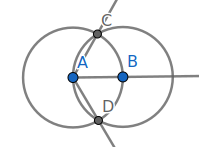
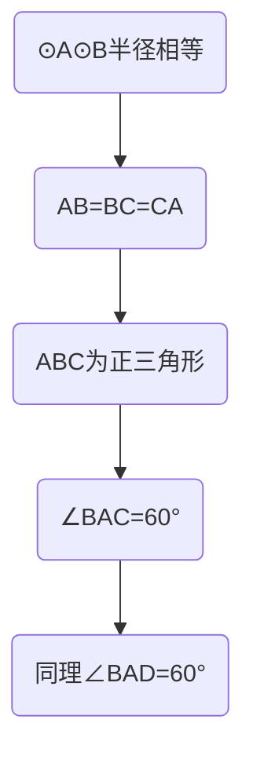
```mermaid
graph TB;
A("⊙A⊙B半径相等")-->B("AB=BC=CA")
B-->C("ABC为正三角形")
C-->D("∠BAC=60°")
D-->E("同理∠BAD=60°")
```
# 1.2
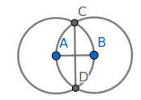
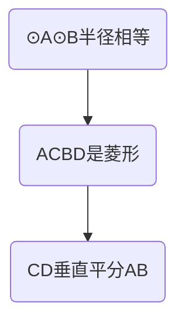
```mermaid
graph TB;
A("⊙A⊙B半径相等")-->B("ACBD是菱形")
B-->C("CD垂直平分AB")
```
# 1.3
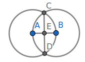
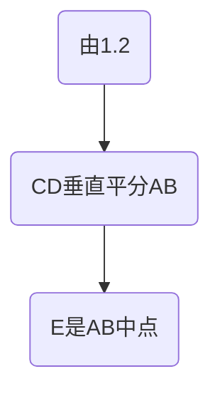
```mermaid
graph TB;
A("由1.2")-->B("CD垂直平分AB")
B-->C("E是AB中点")
```
# 1.4
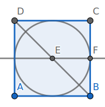
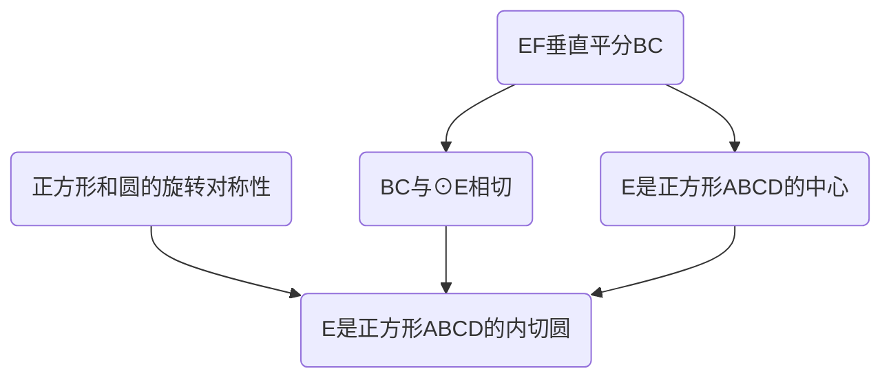
```mermaid
graph TB;
A("EF垂直平分BC")-->B("BC与⊙E相切")
A-->C("E是正方形ABCD的中心")
D("正方形和圆的旋转对称性")-->E("E是正方形ABCD的内切圆")
B-->E
C-->E
```
# 1.5
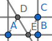
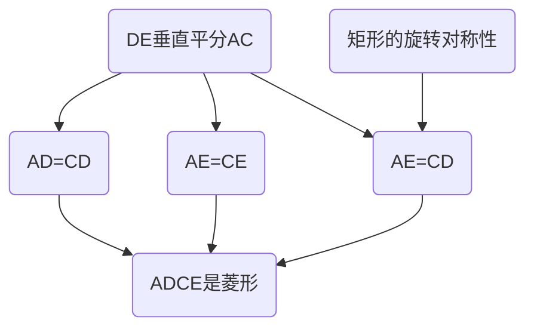
```mermaid
graph TB;
A("DE垂直平分AC")-->B("AD=CD")
A-->C("AE=CE")
D("矩形的旋转对称性")-->E("AE=CD")
A-->E
F("ADCE是菱形")
B-->F
C-->F
E-->F
```
# 1.6.2L
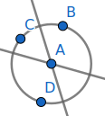
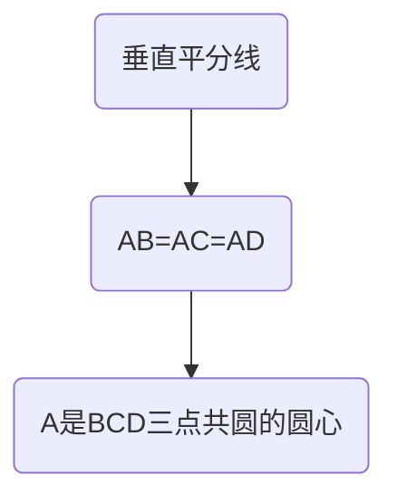
```mermaid
graph TB;
A("垂直平分线")-->B("AB=AC=AD")
B-->C("A是BCD三点共圆的圆心")
```
# 1.6.5E
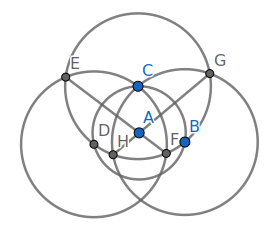
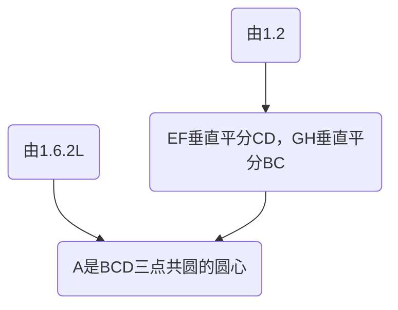
```mermaid
graph TB;
A("由1.2")-->B("EF垂直平分CD，GH垂直平分BC")
C("由1.6.2L")-->D("A是BCD三点共圆的圆心")
B-->D
```
# 1.7.6L
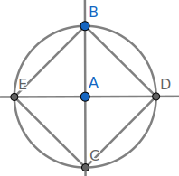
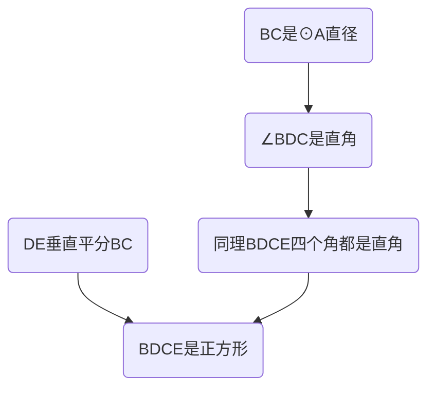
```mermaid
graph TB;
A("BC是⊙A直径")-->B("∠BDC是直角")
B-->C("同理BDCE四个角都是直角")
D("DE垂直平分BC")-->E("BDCE是正方形")
C-->E
```
# 1.7.7E
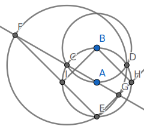
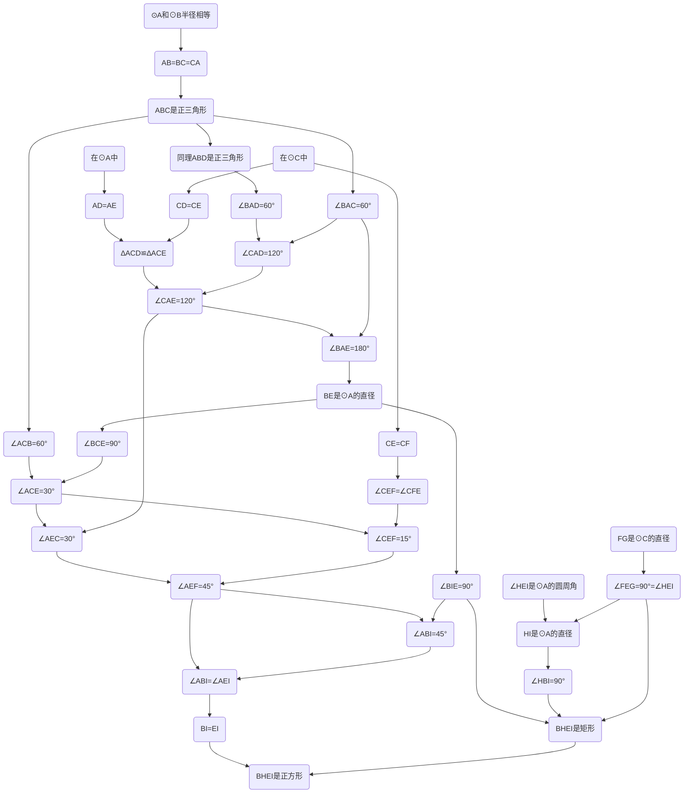
```mermaid
graph TB;
A("⊙A和⊙B半径相等")-->B("AB=BC=CA")
B-->C("ABC是正三角形")
C-->D("同理ABD是正三角形")
C-->E("∠BAC=60°")
D-->F("∠BAD=60°")
F-->G
E-->G("∠CAD=120°")
H("在⊙A中")-->I("AD=AE")
J("在⊙C中")-->K("CD=CE")
I-->L("∆ACD≌∆ACE")
K-->L
L-->M
G-->M("∠CAE=120°")
M-->N("∠BAE=180°")
E-->N
N-->O("BE是⊙A的直径")
O-->P("∠BIE=90°")
Q("FG是⊙C的直径")-->R("∠FEG=90°=∠HEI")
S("∠HEI是⊙A的圆周角")-->T("HI是⊙A的直径")
R-->T
T-->U("∠HBI=90°")
P-->V
U-->V("BHEI是矩形")
R-->V
O-->W("∠BCE=90°")
C-->X("∠ACB=60°")
X-->Y("∠ACE=30°")
W-->Y
J-->Z("CE=CF")
Z-->A0("∠CEF=∠CFE")
Y-->A1
A0-->A1("∠CEF=15°")
Y-->A2
M-->A2("∠AEC=30°")
A2-->A3("∠AEF=45°")
A1-->A3
A3-->A4("∠ABI=45°")
P-->A4
A3-->A5
A4-->A5("∠ABI=∠AEI")
A5-->A6("BI=EI")
A6-->A7("BHEI是正方形")
V-->A7
```