# 2.1.2L
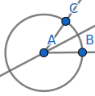
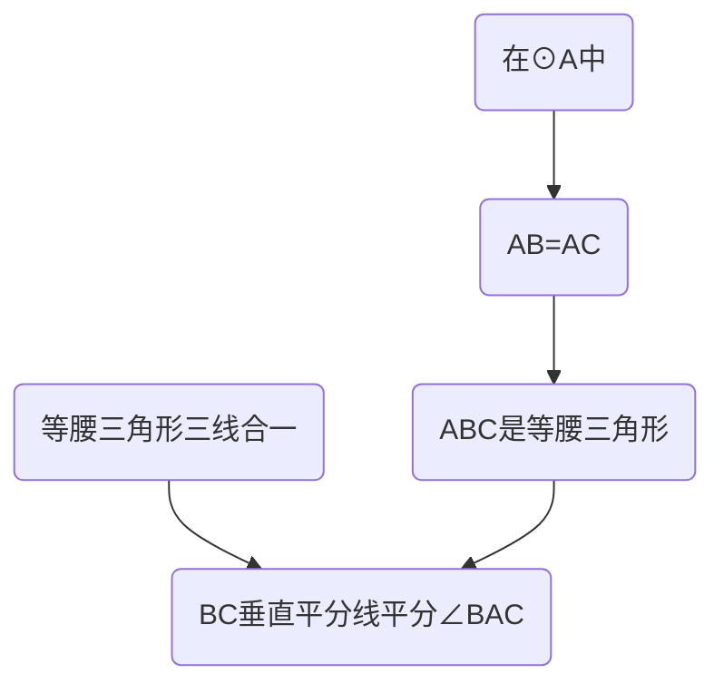
```mermaid
graph TB;
A("在⊙A中")-->B("AB=AC")
B-->D("ABC是等腰三角形")
E("等腰三角形三线合一")-->F("BC垂直平分线平分∠BAC")
D-->F
```
# 2.1.4E
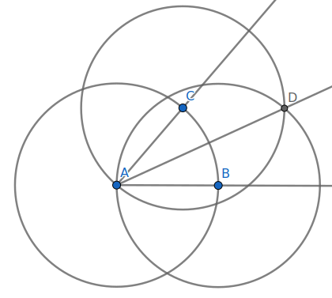
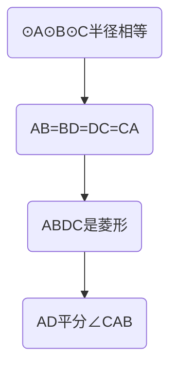
```mermaid
graph TB;
A("⊙A⊙B⊙C半径相等")-->B("AB=BD=DC=CA")
B-->C("ABDC是菱形")
C-->D("AD平分∠CAB")
```
# 2.2.2L
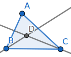
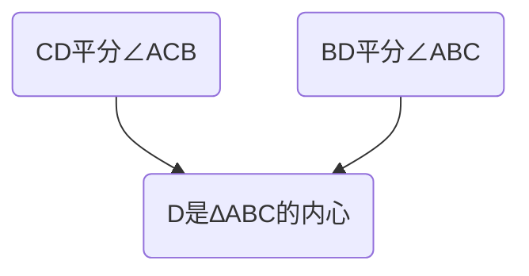
```mermaid
graph TB;
A("BD平分∠ABC")
B("CD平分∠ACB")-->C("D是∆ABC的内心")
A-->C
```
# 2.2.6E
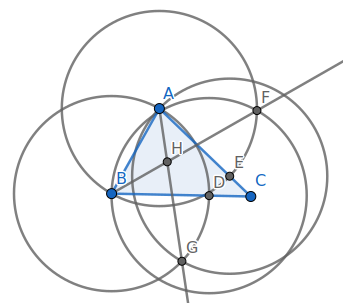
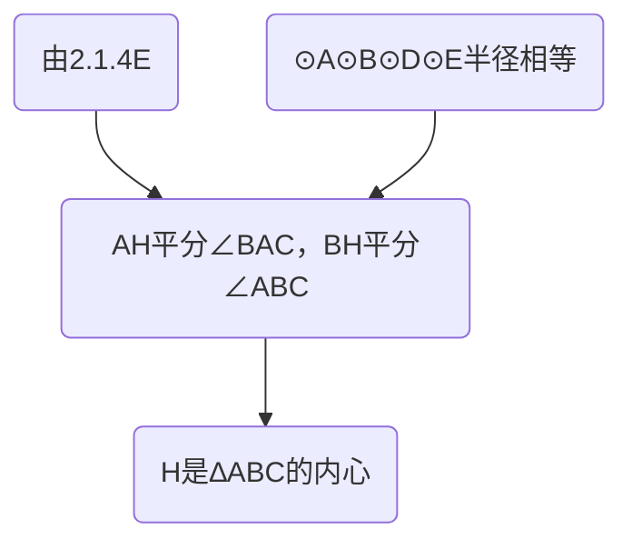
```mermaid
graph TB;
A("⊙A⊙B⊙D⊙E半径相等")
B("由2.1.4E")-->C("AH平分∠BAC，BH平分∠ABC")
A-->C
C-->D("H是∆ABC的内心")
```
# 2.3

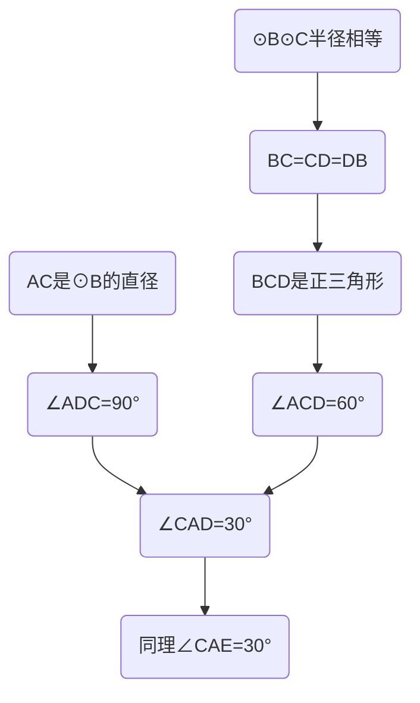
```mermaid
graph TB;
A("⊙B⊙C半径相等")-->B("BC=CD=DB")
B-->C("BCD是正三角形")
C-->D("∠ACD=60°")
E("AC是⊙B的直径")-->F("∠ADC=90°")
F-->G("∠CAD=30°")
D-->G
G-->H("同理∠CAE=30°")
```
# 2.4
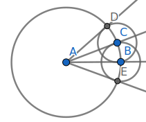
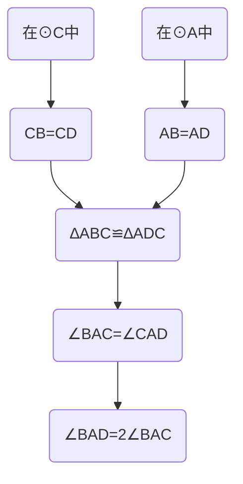
```mermaid
graph TB;
A("在⊙A中")-->B("AB=AD")
C("在⊙C中")-->D("CB=CD")
D-->E("∆ABC≌∆ADC")
B-->E
E-->F("∠BAC=∠CAD")
F-->G("∠BAD=2∠BAC")
```
# 2.5
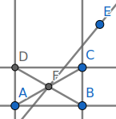
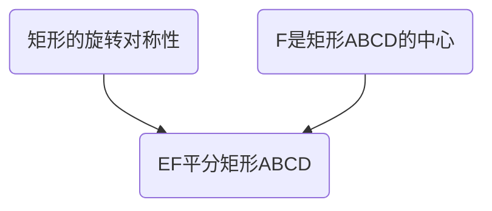
```mermaid
graph TB;
A("F是矩形ABCD的中心")
B("矩形的旋转对称性")-->C("EF平分矩形ABCD")
A-->C
```
# 2.6.2L
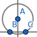
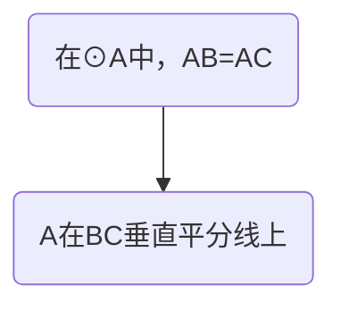
```mermaid
graph TB;
A("在⊙A中，AB=AC")-->B("A在BC垂直平分线上")
```
# 2.6.3E
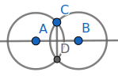
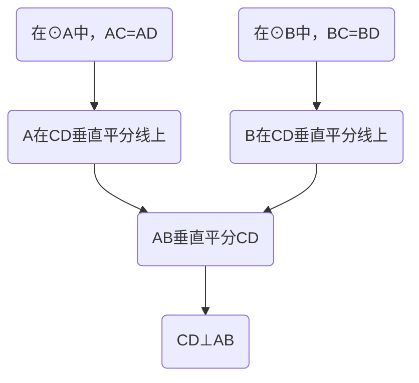
```mermaid
graph TB;
A("在⊙A中，AC=AD")-->B("A在CD垂直平分线上")
C("在⊙B中，BC=BD")-->D("B在CD垂直平分线上")
B-->E("AB垂直平分CD")
D-->E
E-->F("CD⊥AB")
```
# 2.7.1L
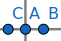
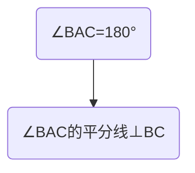
```mermaid
graph TB;
A("∠BAC=180°")-->B("∠BAC的平分线⊥BC")
```
# 2.7.3E
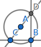
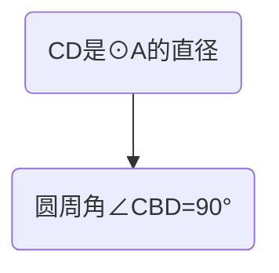
```mermaid
graph TB;
A("CD是⊙A的直径")-->B("圆周角∠CBD=90°")
```
# 2.8.2L
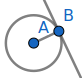
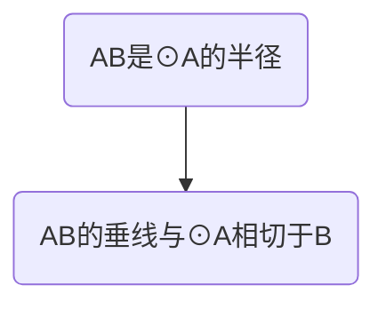
```mermaid
graph TB;
A("AB是⊙A的半径")-->B("AB的垂线与⊙A相切于B")
```
# 2.8.3E
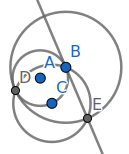
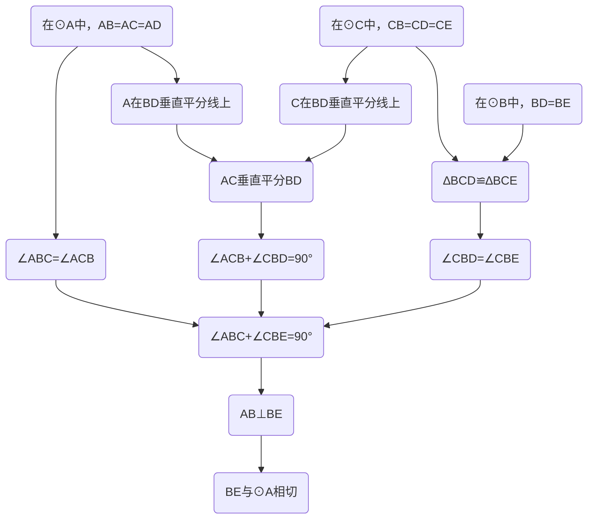
```mermaid
graph TB;
A("在⊙A中，AB=AC=AD")-->B("A在BD垂直平分线上")
A-->C("∠ABC=∠ACB")
D("在⊙B中，BD=BE")
E("在⊙C中，CB=CD=CE")-->F("C在BD垂直平分线上")
B-->G("AC垂直平分BD")
F-->G
E-->H("∆BCD≌∆BCE")
D-->H
G-->I("∠ACB+∠CBD=90°")
H-->J("∠CBD=∠CBE")
C-->K("∠ABC+∠CBE=90°")
I-->K
J-->K
K-->L("AB⊥BE")
L-->M("BE与⊙A相切")
```
# 2.9.2L
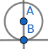
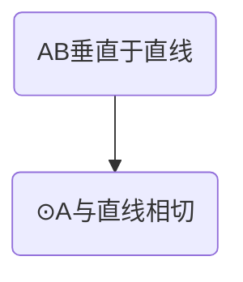
```mermaid
graph TB;
A("AB垂直于直线")-->B("⊙A与直线相切")
```
# 2.9.4E
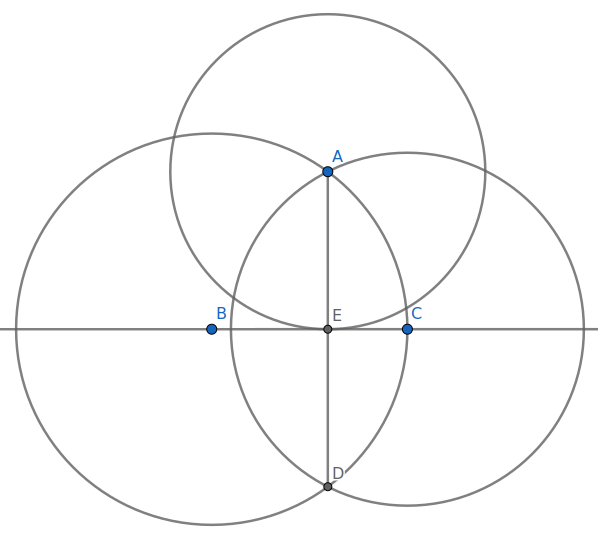
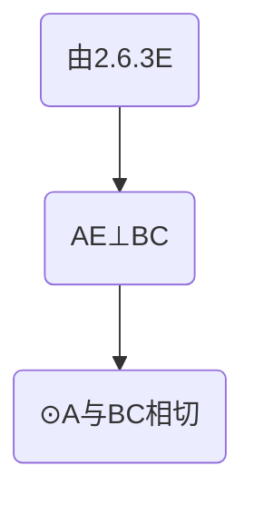
```mermaid
graph TB;
A("由2.6.3E")-->B("AE⊥BC")
B-->C("⊙A与BC相切")
```
# 2.10.4L
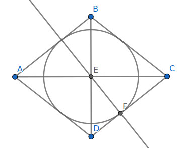
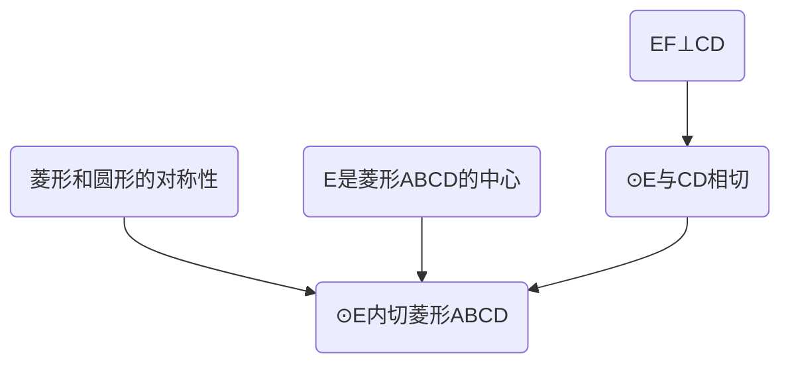
```mermaid
graph TB;
A("EF⊥CD")-->B("⊙E与CD相切")
C("E是菱形ABCD的中心")
D("菱形和圆形的对称性")-->E("⊙E内切菱形ABCD")
C-->E
B-->E
```
# 2.10.6E
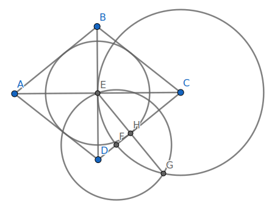
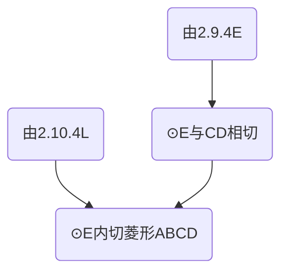
```mermaid
graph TB;
A("由2.9.4E")-->B("⊙E与CD相切")
C("由2.10.4L")-->D("⊙E内切菱形ABCD")
B-->D
```