# 3.1.2L
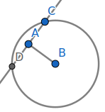
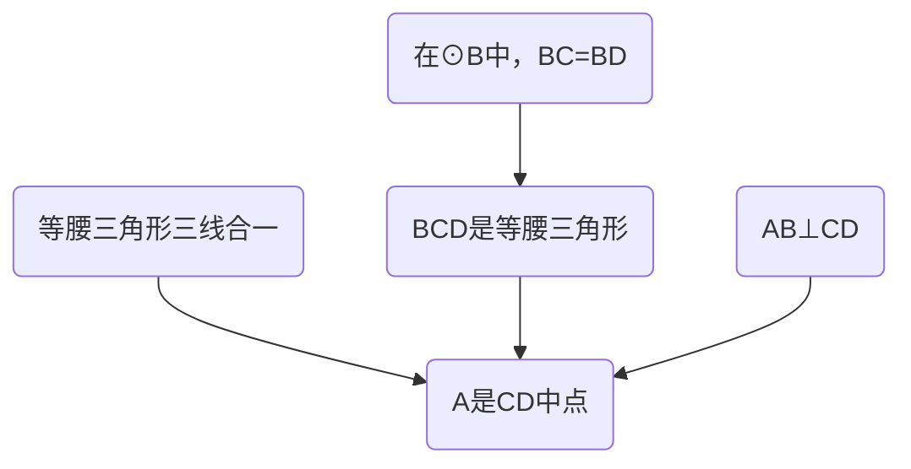
```mermaid
graph TB;
A("在⊙B中，BC=BD")-->B("BCD是等腰三角形")
C("AB⊥CD")
D("等腰三角形三线合一")-->E("A是CD中点")
B-->E
C-->E
```
# 3.1.4E
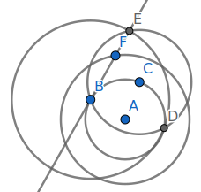
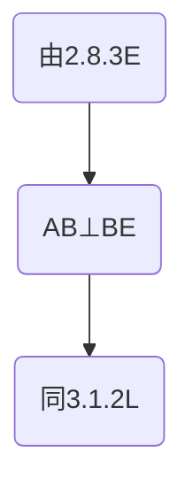
```mermaid
graph TB;
A("由2.8.3E")-->B("AB⊥BE")
B-->C("同3.1.2L")
```
# 3.2.3L
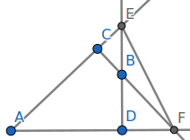

显然
# 3.2.6E

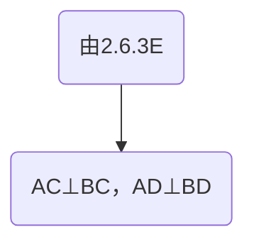
```mermaid
graph TB;
A("由2.6.3E")-->B("AC⊥BC，AD⊥BD")
```
# 3.3
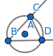
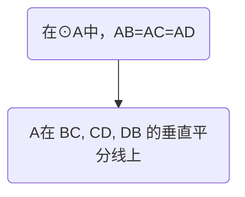
```mermaid
graph TB;
A("在⊙A中，AB=AC=AD")-->B("A在 BC, CD, DB 的垂直平分线上")
```
# 3.4
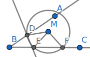
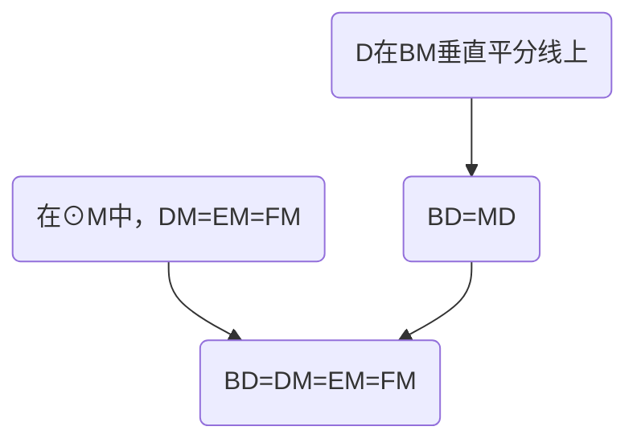
```mermaid
graph TB;
A("D在BM垂直平分线上")-->B("BD=MD")
C("在⊙M中，DM=EM=FM")-->D("BD=DM=EM=FM")
B-->D
```
# 3.5.3L
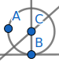
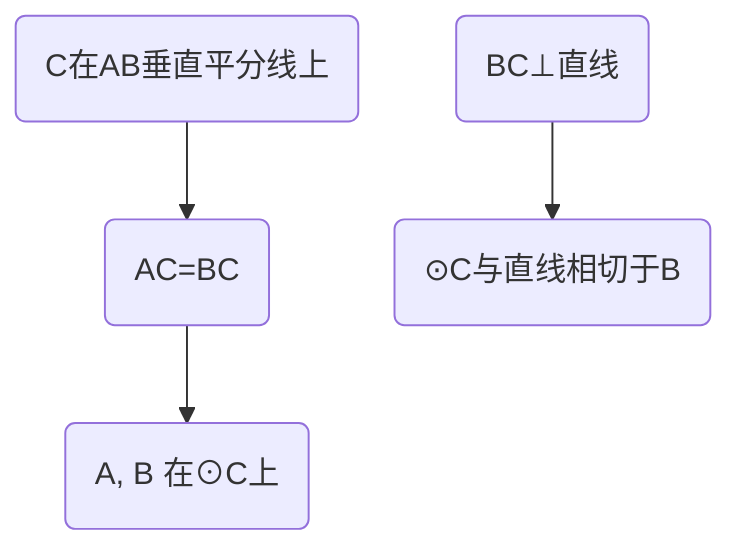
```mermaid
graph TB;
A("C在AB垂直平分线上")-->B("AC=BC")
B-->C("A, B 在⊙C上")
D("BC⊥直线")-->E("⊙C与直线相切于B")
```
# 3.5.6E

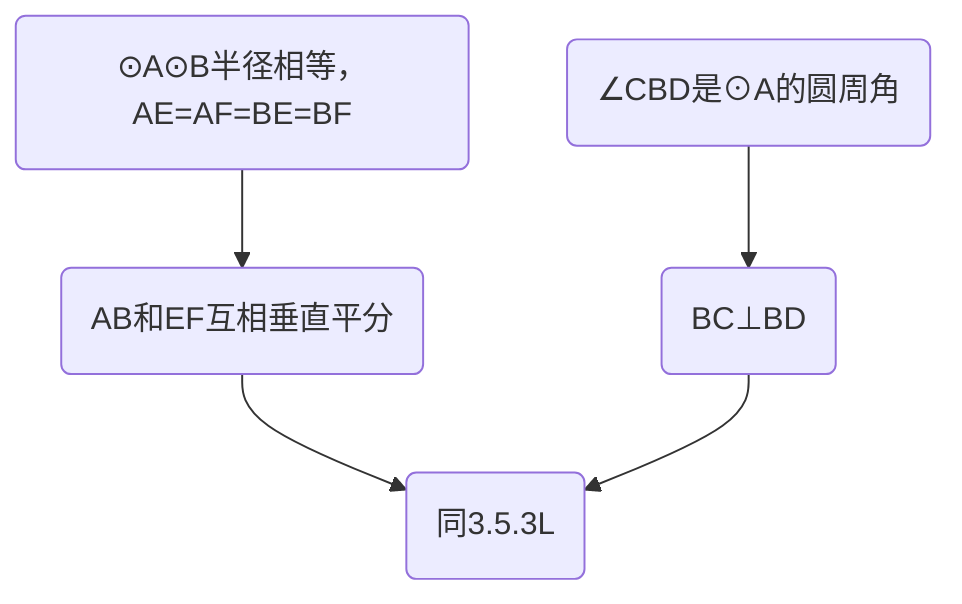
```mermaid
graph TB;
A("⊙A⊙B半径相等，AE=AF=BE=BF")-->B("AB和EF互相垂直平分")
C("∠CBD是⊙A的圆周角")-->D("BC⊥BD")
B-->E("同3.5.3L")
D-->E
```
# 3.6.3L
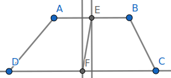
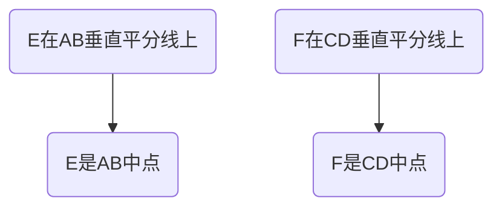
```mermaid
graph TB;
A("E在AB垂直平分线上")-->B("E是AB中点")
C("F在CD垂直平分线上")-->D("F是CD中点")
```
# 3.6.5E
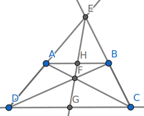
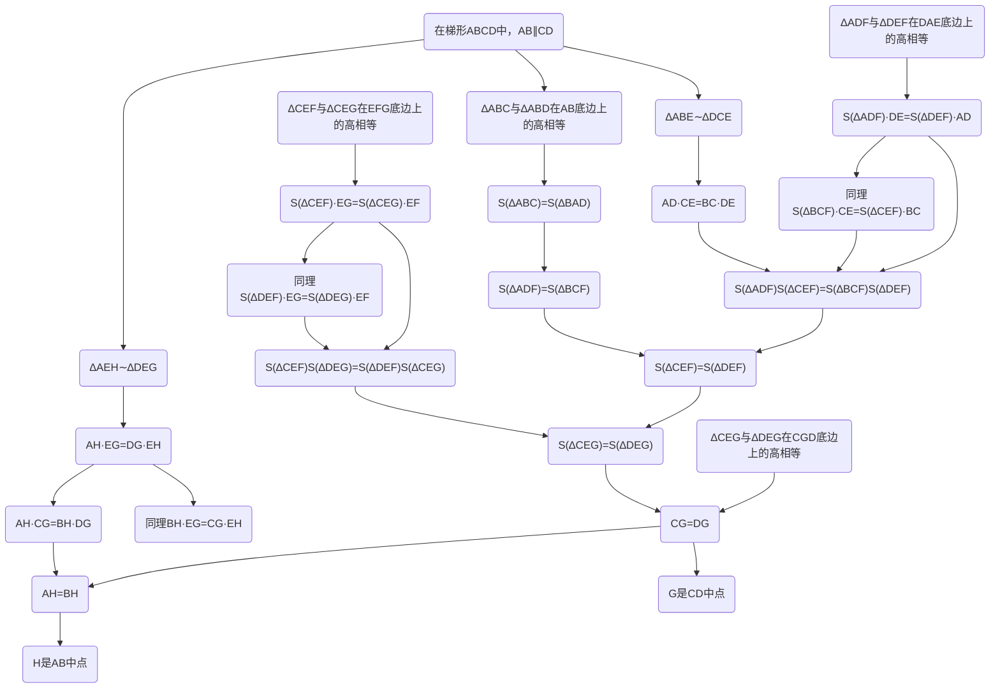
```mermaid
graph TB;
A("在梯形ABCD中，AB∥CD")-->B("∆ABC与∆ABD在AB底边上的高相等")
B-->C("S(∆ABC)=S(∆BAD)")
C-->D("S(∆ADF)=S(∆BCF)")
E("∆ADF与∆DEF在DAE底边上的高相等")-->F("S(∆ADF)·DE=S(∆DEF)·AD")
F-->G("同理S(∆BCF)·CE=S(∆CEF)·BC")
A-->H("∆ABE∼∆DCE")
H-->I("AD·CE=BC·DE")
F-->J("S(∆ADF)S(∆CEF)=S(∆BCF)S(∆DEF)")
G-->J
I-->J
J-->K
D-->K("S(∆CEF)=S(∆DEF)")
L("∆CEF与∆CEG在EFG底边上的高相等")-->M("S(∆CEF)·EG=S(∆CEG)·EF")
M-->N("同理S(∆DEF)·EG=S(∆DEG)·EF")
M-->O("S(∆CEF)S(∆DEG)=S(∆DEF)S(∆CEG)")
N-->O
K-->P("S(∆CEG)=S(∆DEG)")
O-->P
Q("∆CEG与∆DEG在CGD底边上的高相等")-->R("CG=DG")
P-->R
A-->S("∆AEH∼∆DEG")
S-->T("AH·EG=DG·EH")
T-->U("同理BH·EG=CG·EH")
T-->V("AH·CG=BH·DG")
R-->W("AH=BH")
V-->W
R-->X("G是CD中点")
W-->Y("H是AB中点")
```
# 3.7.2L
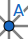
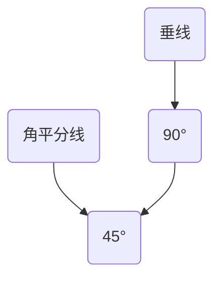
```mermaid
graph TB;
A("垂线")-->B("90°")
C("角平分线")-->D("45°")
B-->D
```
# 3.7.5E
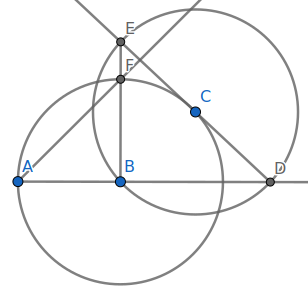
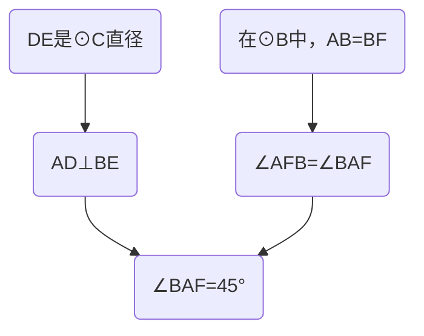
```mermaid
graph TB;
A("在⊙B中，AB=BF")-->B("∠AFB=∠BAF")
C("DE是⊙C直径")-->D("AD⊥BE")
D-->E("∠BAF=45°")
B-->E
```
# 3.8.5L
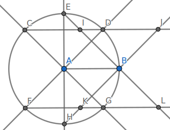
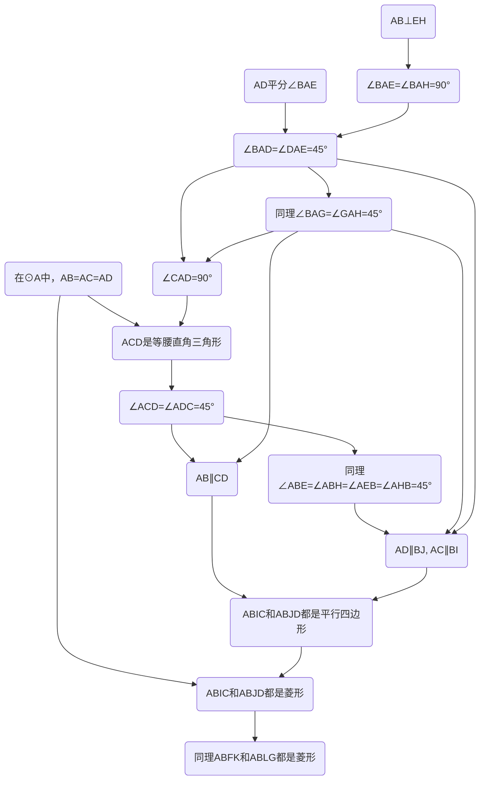
```mermaid
graph TB;
A("在⊙A中，AB=AC=AD")
B("AB⊥EH")-->C("∠BAE=∠BAH=90°")
D("AD平分∠BAE")-->E("∠BAD=∠DAE=45°")
C-->E
E-->F("同理∠BAG=∠GAH=45°")
E-->G("∠CAD=90°")
F-->G
A-->H("ACD是等腰直角三角形")
G-->H
H-->I("∠ACD=∠ADC=45°")
I-->K
F-->K("AB∥CD")
I-->L("同理∠ABE=∠ABH=∠AEB=∠AHB=45°")
L-->M("AD∥BJ, AC∥BI")
F-->M
E-->M
K-->N("ABIC和ABJD都是平行四边形")
M-->N
A-->O("ABIC和ABJD都是菱形")
N-->O
O-->P("同理ABFK和ABLG都是菱形")
```
# 3.8.7E
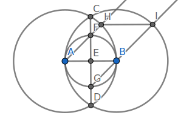
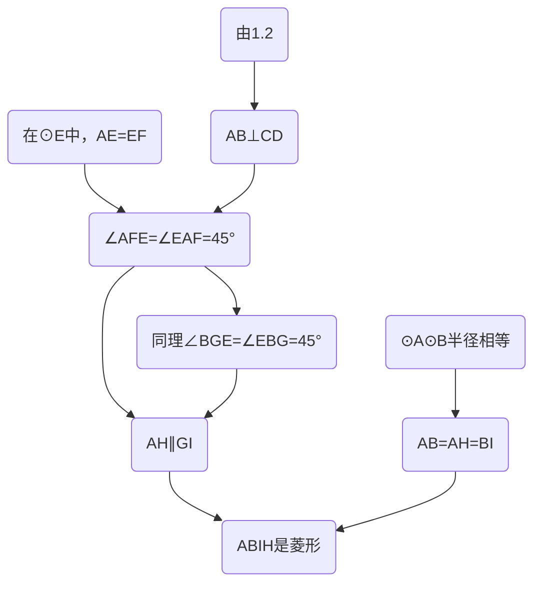
```mermaid
graph TB;
A("由1.2")-->B("AB⊥CD")
C("在⊙E中，AE=EF")-->D("∠AFE=∠EAF=45°")
B-->D
D-->E("同理∠BGE=∠EBG=45°")
D-->F("AH∥GI")
E-->F
G("⊙A⊙B半径相等")-->H("AB=AH=BI")
F-->I("ABIH是菱形")
H-->I
```
# 3.9
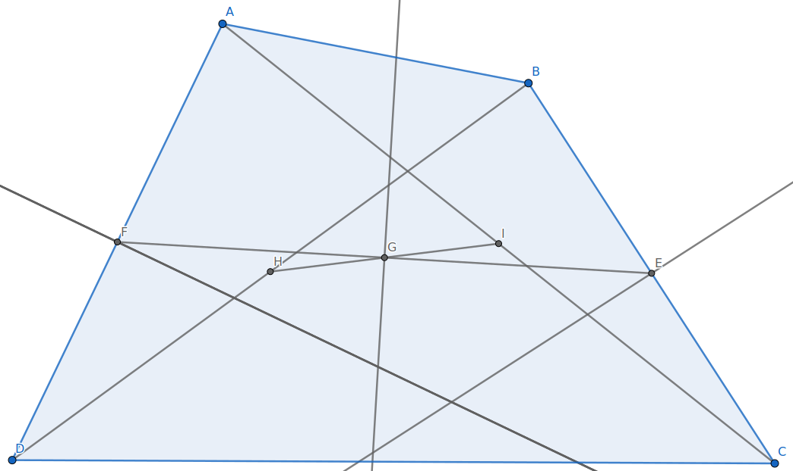
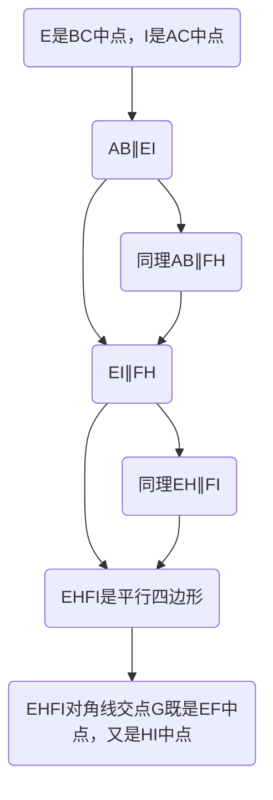
```mermaid
graph TB;
A("E是BC中点，I是AC中点")-->B("AB∥EI")
B-->C("同理AB∥FH")
B-->D("EI∥FH")
C-->D
D-->E("同理EH∥FI")
D-->F("EHFI是平行四边形")
E-->F
F-->G("EHFI对角线交点G既是EF中点，又是HI中点")
```