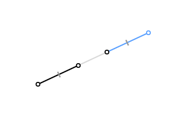
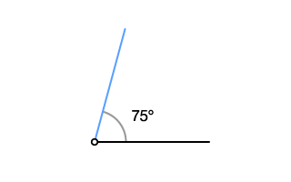
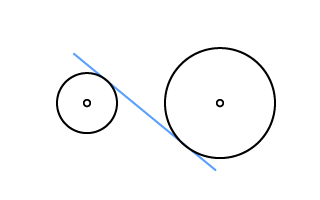
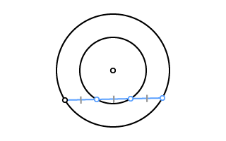
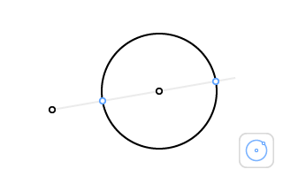

##### T1_Line
- Level Tutorial
- 英文标题: Tutorial: Line Tool
- 中文标题: 教程：直线工具
- 英文描述: Construct a triangle with the given vertices. To create a segment or a line, select the Line tool and click on one point, then on another one.
- 中文标题: 以给定顶点作一个三角形。要作一条线段或直线，选择直线工具，先点击一点，再点击另一点；或者用手指在两点之间拖动。
- 英文谚语: The idealized ruler, known as a straightedge, is assumed to be infinite in length, and has no markings on it and only one edge.
- 中文谚语: 理想化的尺，称为直尺，是假定长度无限，没有刻度而且只有一条边。
- 英文谚语作者: Wikipedia
- 中文谚语作者: 维基百科

##### T2_Circle
- Level Tutorial
- 英文标题: Tutorial: Circle Tool
- 中文标题: 教程：圆工具
- 英文描述: Construct a circle with center O through the point P. Select the Circle tool and click on the center, then on any point of the circle.
- 中文描述: 以O为圆心，过点P作一个圆。选择圆工具，依次点击圆心和圆周上任意一点。也可以用手指从圆心拖动到圆周上的点。
- 英文谚语: Circles can only be drawn starting from two given points: the center and a point on the circle. The compass collapses when it is not drawing a circle.
- 中文谚语: 圆只能由给定的两点作出：圆心及圆周上一点。不作圆时的圆规是闭合的。
- 英文谚语作者: Wikipedia
- 中文谚语作者: 维基百科

##### T3_Point
- Level Tutorial
- 英文标题: Tutorial: Point Tool
- 中文标题: 教程：点工具
- 英文描述: Construct all the intersection points. Select the Point tool and click on the field to create a new point. Points are automatically stuck to the nearest intersection or line.
- 中文描述: 作出所有的交点。选择点工具，点击画板任意一处，即可新建一个点。手指点击时，距离最近的交点或直线将会被选中。
- 英文谚语: Euclid originally defined the point as “that which has no part”.
- 中文谚语: 欧几里德原本一开始将点定义为“不能分割的东西”。
- 英文谚语作者: Wikipedia
- 中文谚语作者: 维基百科

##### TPerpBisector
- Level Tutorial
- 英文标题: Tutorial: Perpendicular Bisector
- 中文标题: 教程：垂直平分线
- 英文描述: You have discovered the Perpendicular Bisector tool. Click sequentially on two points to see how it works.
- 中文描述: 您已解锁了垂直平分线工具。依次点击两点查看这个工具的功能。或者用手指在两点之间拖动。
- 英文谚语: Note that the Perpendicular Bisector tool costs 3 elementary (E) moves.
- 中文谚语: 注意使用垂直平分线工具将耗费3个基础（E）步骤。
- 英文谚语作者: Euclidea Manual
- 中文谚语作者: 游戏说明

##### TBisectAngle
- Level Tutorial
- 英文标题: Tutorial: Angle Bisector
- 中文标题: 教程：角平分线
- 英文描述: You have discovered the Angle Bisector tool. Click on any point on a side, on the vertex, and on any point on the other side.
- 中文描述: 您已解锁了角平分线工具。依次点击边上的任意一点、顶点和另一边上的任意一点。或者用手指沿着两条边拖动。
- 英文谚语: Note that the Angle Bisector tool costs 4 elementary (E) moves.
- 中文谚语: 注意使用角平分线工具将耗费4个基础（E）步骤。
- 英文谚语作者: Euclidea Manual
- 中文谚语作者: 游戏说明

##### TDropPerp
- Level Tutorial
- 英文标题: Tutorial: Perpendicular
- 中文标题: 教程：垂线
- 英文描述: You have discovered the Perpendicular tool. Click on the line, then on the point.
- 中文描述: 您已解锁了垂线工具。依次点击直线和点。或者用手指从直线拖动到点。
- 英文谚语: Note that the Perpendicular tool costs 3 elementary (E) moves.
- 中文谚语: 注意使用垂线工具将耗费3个基础（E）步骤。
- 英文谚语作者: Euclidea Manual
- 中文谚语作者: 游戏说明

##### TParallel
- Level Tutorial
- 英文标题: Tutorial: Parallel Line
- 中文标题: 教程：平行线
- 英文描述: You have discovered the Parallel tool. Click on the line, then on the point.
- 中文描述: 您已解锁了平行线工具。依次点击直线和点。或者用手指从直线拖动到点。
- 英文谚语: Note that the Parallel tool costs 4 elementary (E) moves.
- 中文谚语: 注意使用平行线工具将耗费4个基础（E）步骤。
- 英文谚语作者: Euclidea Manual
- 中文谚语作者: 游戏说明

##### TCircleByRadius
- Level Tutorial
- 英文标题: Tutorial: Non-collapsing Compass
- 中文标题: 教程：圆规
- 英文描述: You have discovered the Non-collapsing Compass tool. Click on two points to set the radius length, then on the center of the circle.
- 中文描述: 您已解锁了圆规工具。依次点击两个点设定半径长度，再点击圆心完成圆的绘制。
- 英文谚语: Note that the Compass tool costs 5 elementary (E) moves.
- 中文谚语: 注意使用圆规工具将耗费5个基础（E）步骤。
- 英文谚语作者: Euclidea Manual
- 中文谚语作者: 游戏说明

##### TIntersect
- 英文标题: Tutorial: Intersect Tool
- 中文标题: 教程：相交工具
- 英文描述: If it is hard to hit the required intersection since lines are too close to each other, use the Intersect tool. Select one object (a circle or a line), then the second one. To practice, construct the intersection of the given circles.
- 中文描述: 如果线与线之间距离太近，难以一下选定所需的交点，可以使用相交工具。 依次选择一个对象（圆或直线），再选择第二个对象。 作为练习，请作出给定圆的交点。
- 英文谚语: Every intersection has a story.
- 中文谚语: 每一个交点都有一段故事。
- 英文谚语作者: Katherine Dunn
- 中文谚语作者: 凯瑟琳·邓恩（美国小说家）

##### TMove
- Level Tutorial
- 英文标题: Tutorial: Move Tool
- 中文标题: 教程：移动工具
- 英文描述: Pascal's theorem states that if a hexagon is inscribed in a circle, then three points of intersection of its opposite sides lie on a straight line. Use the Move tool to see how the theorem works: just drag the blue points.
- 中文描述: 帕斯卡定理指出，如果一个六边形内接于一个圆，则其三条对边的交点共线。使用移动工具了解这个定理的原理：拖动蓝色的点并观察。
- 英文谚语: Our nature consists in motion; complete rest is death.
- 中文谚语: 我们的自然是由运动组成的。彻底的静止就是死亡。
- 英文谚语作者: Blaise Pascal
- 中文谚语作者: 布莱士·帕斯卡（法国哲学家、数学家，概率论奠基人）

#### Angle60
- Level 1.1
-  
- 英文标题: Angle of 60°
- 中文标题: 60° 角
- 英文描述: Construct an angle of 60° with the given side.
- 中文描述: 以给定射线为一边，作一个 60° 角。
- 英文谚语: Let no one ignorant of geometry enter here.
- 中文谚语: 不懂几何者，请勿入此门。
- 英文谚语作者: Plato
- 中文谚语作者: 柏拉图（古希腊哲学家、数学家）

#### PerpBisector
- Level 1.2
-  
- 英文标题: Perpendicular Bisector
- 中文标题: 垂直平分线
- 英文描述: Construct the perpendicular bisector of the segment.
- 中文描述: 作给定线段的垂直平分线。
- 英文谚语: Education is what remains after one has forgotten everything he learned in school.
- 中文谚语: 所谓教育，就是一个人忘掉在学校所学之后保留下来的东西。
- 英文谚语作者: Albert Einstein
- 中文谚语作者: 阿尔伯特·爱因斯坦（德国物理学家）

#### Midpoint
- Level 1.3
-  
- 英文标题: Midpoint
- 中文标题: 中点
- 英文描述: Construct the midpoint between two points.
- 中文描述: 作给定两点的中点。
- 英文谚语: Without geometry, life would be pointless.
- 中文谚语: 没有了几何，生活“一点”意思都没有了。（双关）
- 英文谚语作者: Joke
- 中文谚语作者: 俚语

#### CircleInSquare
- Level 1.4
-  
- 英文标题: Circle in Square
- 中文标题: 正方形的内切圆
- 英文描述: Inscribe a circle in the square.
- 中文描述: 在给定正方形中作一个内切圆。
- 英文谚语: You can't fit a round peg in a square hole.
- 中文谚语: 圆的榫头和方的卯眼是没办法契合的。
- 英文谚语作者: American proverb
- 中文谚语作者: 美国谚语

#### RhombusInRect
- Level 1.5
-  
- 英文标题: Rhombus in Rectangle
- 中文标题: 矩形的内接菱形
- 英文描述: Inscribe a rhombus in the rectangle so that they share a diagonal.
- 中文描述: 在矩形中作一个内接菱形，使它们有一条公共对角线。
- 英文谚语: Without mathematics there is no art.
- 中文谚语: 没有数学，艺术将不复存在。
- 英文谚语作者: Luca Pacioli
- 中文谚语作者: 卢卡·帕乔利（意大利数学家，现代会计之父）

#### CircleCenter
- Level 1.6
-  
- 英文标题: Circle Center
- 中文标题: 圆心
- 英文描述: Construct the center of the circle.
- 中文描述: 作给定圆的圆心。
- 英文谚语: Nature is an infinite sphere of which the center is everywhere and the circumference nowhere.
- 中文谚语: 自然就像个无穷大的球体，明明到处都是中心，边界却无处可寻。
- 英文谚语作者: Blaise Pascal
- 中文谚语作者: 布莱士·帕斯卡（法国哲学家、数学家，概率论奠基人）

#### SquareInCircle
- Level 1.7
-  
- 英文标题: Inscribed Square
- 中文标题: 内接正方形
- 英文描述: Inscribe a square in the circle. A vertex is given.
- 中文描述: 以给定点为顶点，在圆中作一个内接正方形。
- 英文谚语: Where there is matter, there is geometry.
- 中文谚语: 哪里有物质，哪里就有几何。
- 英文谚语作者: Johannes Kepler
- 中文谚语作者: 约翰尼斯·开普勒（德国天文学家）

#### BisectAngle
- Level 2.1
-  
- 英文标题: Angle Bisector
- 中文标题: 角平分线
- 英文描述: Construct the line that bisects the given angle.
- 中文描述: 作一条直线，平分给定角。
- 英文谚语: The description of right lines and circles, upon which geometry is founded, belongs to mechanics. Geometry does not teach us to draw these lines, but requires them to be drawn.
- 中文谚语: 几何学的基石——直线与圆的描述，是经典力学的一部分。几何学并非会教我们怎样画线，而是制定怎样画线的规则。
- 英文谚语作者: Isaac Newton
- 中文谚语作者: 艾萨克·牛顿（英国物理学家、数学家）

#### RhombusInTriangle
- Level 2.2
-  
- 英文标题: Rhombus in Triangle
- 中文标题: 三角形的内接菱形
- 英文描述: Inscribe a rhombus in the triangle so that they share the common angle A.
- 中文描述: 在三角形中作一个内接菱形，使它们有一个公共角A。
- 英文谚语: The moving power of mathematical invention is not reasoning but imagination.
- 中文谚语: 推动数学发现前进的动力并非来自理性，而是来自想象力的发挥。
- 英文谚语作者: Augustus de Morgan
- 中文谚语作者: 奥古斯都·德·摩根（英国数学家、逻辑学家）

#### Angle30
- Level 2.3
-  
- 英文标题: Angle of 30°
- 中文标题: 30°角
- 英文描述: Construct an angle of 30° with the given side.
- 中文描述: 以给定射线为一边，作一个30°角。
- 英文谚语: Inspiration is needed in geometry, just as much as in poetry.
- 中文谚语: 几何与诗歌一样需要的是灵感。
- 英文谚语作者: Alexander Pushkin
- 中文谚语作者: 亚历山大·普希金（俄国诗人、散文家、剧作家）

#### DoubleAngle
- Level 2.4
-  
- 英文标题: Double Angle
- 中文标题: 二倍角
- 英文描述: Construct an angle equal to the given one so that they share one side.
- 中文描述: 作一个与已知角相等的角，使它们有一条公共边。
- 英文谚语: Contradiction is not a sign of falsity, nor the lack of contradiction a sign of truth.
- 中文谚语: 矛盾不是假象的标志，但不矛盾也未必就是真相的化身。
- 英文谚语作者: Blaise Pascal
- 中文谚语作者: 布莱士·帕斯卡（法国哲学家、数学家，概率论奠基人）

#### CutRectangle
- Level 2.5
-  
- 英文标题: Cut Rectangle
- 中文标题: 分割矩形
- 英文描述: Construct a line through the given point that cuts the rectangle into two parts of equal area.
- 中文描述: 过给定点作一条直线，将矩形分割成面积相等的两部分。
- 英文谚语: Measure twice, cut once!
- 中文谚语: 三思而后行。
- 英文谚语作者: Proverb
- 中文谚语作者: 谚语

#### DropPerp
- Level 2.6
-  
- 英文标题: Drop a Perpendicular
- 中文标题: 过线外一点作垂线
- 英文描述: Drop a perpendicular from the point to the line.
- 中文描述: 由给定点向直线引一条垂线。
- 英文谚语: The knowledge of which geometry aims is the knowledge of the eternal.
- 中文谚语: 几何学所追求的知识才是不朽的知识。
- 英文谚语作者: Plato
- 中文谚语作者: 柏拉图（古希腊哲学家、数学家）

#### ErectPerp
- Level 2.7
-  
- 英文标题: Erect a Perpendicular
- 中文标题: 过线上一点作垂线
- 英文描述: Erect a perpendicular from the point on the line.
- 中文描述: 过直线上的一个点作该直线的垂线。
- 英文谚语: What we know is not much. What we do not know is immense.
- 中文谚语: 我们知道的东西是有限的，我们不知道的东西则是无穷的。
- 英文谚语作者: Pierre-Simon Laplace
- 中文谚语作者: 皮埃尔-西蒙·拉普拉斯（法国数学家、天文学家）

#### Tangent1
- Level 2.8
-  
- 英文标题: Tangent to Circle at Point
- 中文标题: 与圆切于某点的直线
- 英文描述: Construct a tangent to the circle at the given point.
- 中文描述: 作一条切线，使其在给定点与圆相切。
- 英文谚语: If a man's wit be wandering, let him study the mathematics.
- 中文谚语: 假若一个人心神散乱，最好让他学习数学。
- 英文谚语作者: Francis Bacon
- 中文谚语作者: 弗朗西斯·培根（英国哲学家）

#### CircleTangentL
- Level 2.9
-  
- 英文标题: Circle Tangent to Line
- 中文标题: 与直线相切的圆
- 英文描述: Construct a circle with the given center that is tangent to the given line.
- 中文描述: 以给定圆心作圆，使其与给定直线相切。
- 英文谚语: Intellectual labor in math lessons is the touchstone of thinking.
- 中文谚语: 数学上的智力是思想的试金石。
- 英文谚语作者: Vasili Sukhomlinsky
- 中文谚语作者: 瓦西里·苏霍姆林斯基（俄国教育家）

#### CircleInRhombus
- Level 2.10
-  
- 英文标题: Сircle in Rhombus
- 中文标题: 菱形的内切圆
- 英文描述: Inscribe a circle in the rhombus.
- 中文描述: 在菱形中作一个内切圆。
- 英文谚语: The mathematician's patterns, like the painter's or the poet's must be beautiful; the ideas like the colours or the words, must fit together in a harmonious way.
- 中文谚语: 数学家的风格，就如同画家和诗人的风格一样必须是美的；思想就像颜料或词藻，必须以和谐的方式相融合。
- 英文谚语作者: Godfrey Hardy
- 中文谚语作者: 高德菲·哈代（英国数学家）

#### ChordMidpoint
- Level 3.1
-  
- 英文标题: Chord Midpoint
- 中文标题: 弦中点
- 英文描述: Construct a chord whose midpoint is given.
- 中文描述: 作一条以给定点为中点的弦。
- 英文谚语: The study of the mathematics, like the Nile, begins in minuteness, but ends in magnificence.
- 中文谚语: 数学的研究，如同尼罗河，起源于微末，终止于宏大。
- 英文谚语作者: Charles Colton
- 中文谚语作者: 查尔斯·科尔顿（英国作家）

#### ATrByOrthocenter
- Level 3.2
-  
- 英文标题: Triangle by Angle and Orthocenter
- 中文标题: 由角和垂心定义的三角形
- 英文描述: Construct a segment connecting the sides of the angle to get a triangle whose orthocenter is in the point O.
- 中文描述: 作一条线段，使其连接已知角的两边，从而获得一个垂心为点O的三角形。
- 英文谚语: A mathematician is a machine for turning coffee into theorems.
- 中文谚语: 所谓数学家就是一部化咖啡为定理的机器。
- 英文谚语作者: Alfred Rényi
- 中文谚语作者: 阿尔弗雷德·瑞尼（匈牙利数学家）

#### ATrByCircumcenter
- Level 3.3
-  
- 英文标题: Intersection of Perpendicular Bisectors
- 中文标题: 垂直平分线的交点
- 英文描述: Construct a segment connecting the sides of the angle to get a triangle whose perpendicular bisectors are intersected in the point O.
- 中文描述: 作一条线段，使其连接已知角的两边，从而获得一个三条垂直平分线相交于点O的三角形。
- 英文谚语: Knowledge exists to be imparted.
- 中文谚语: 知识的存在的价值在于传承。
- 英文谚语作者: Ralph Emerson.
- 中文谚语作者: 拉尔夫·爱默生（美国思想家、文学家、诗人）

#### AEqualSegments1
- Level 3.4
-  
- 英文标题: Three equal segments - 1
- 中文标题: 三条相等的线段 - 1
- 英文描述: Given an angle ABC and a point M inside it, find points D on BA and E on BC and construct segments DM and ME such that BD = DM = ME.
- 中文描述: 已知角ABC和其内一点M，在BA和BC上分别求点D和点E，作线段DM和ME，使BD=DM=ME。
- 英文谚语: All knowledge degenerates into probability.
- 中文谚语: 所有知识都会简化为概率。
- 英文谚语作者: David Hume
- 中文谚语作者: 大卫·休谟（苏格兰哲学家）

#### CircleTangentPL
- Level 3.5
-  
- 英文标题: Circle through Point Tangent to Line
- 中文标题: 过定点与直线相切的圆
- 英文描述: Construct a circle through the point A that is tangent to the given line at the point B.
- 中文描述: 作一个圆，使其经过点A，并与给定直线相切于点B。
- 英文谚语: Knowledge comes, but wisdom lingers.
- 中文谚语: 知识闪亮登场，智慧却姗姗来迟。
- 英文谚语作者: Alfred Tennyson
- 中文谚语作者: 阿尔弗雷德·丁尼生（英国诗人）

#### TrapezoidCut
- Level 3.6
-  
- 英文标题: Midpoints of Trapezoid Bases
- 中文标题: 梯形底边的中点
- 英文描述: Construct a line passing through the midpoints of the trapezoid bases.
- 中文描述: 作一条经过梯形底边中点的直线。
- 英文谚语: If there is a God, he is a great mathematician.
- 中文谚语: 是否有一位神，他本身就是名伟大的数学家。
- 英文谚语作者: Paul Dirac
- 中文谚语作者: 保罗·狄拉克（英国理论物理学家）

#### Angle45
- Level 3.7
-  
- 英文标题: Angle of 45°
- 中文标题: 45°角
- 英文描述: Construct an angle of 45° with the given side.
- 中文描述: 以给定射线为一边，作一个45°角。
- 英文谚语: He is unworthy of the name of man who is ignorant of the fact that the diagonal of a square is incommensurable with its side.
- 中文谚语: 如果谁不知道正方形的对角线不能与其边长通约的事实，那他就不配拥有人的称呼。
- 英文谚语作者: Plato
- 中文谚语作者: 柏拉图（古希腊哲学家、数学家）

#### Lozenge
- Level 3.8
-  
- 英文标题: Lozenge
- 中文标题: 菱形
- 英文描述: Construct a rhombus with the given side and an angle of 45° in a vertex.
- 中文描述: 以给定线段为一边，作一个顶角为45°的菱形。
- 英文谚语: To think deeply of simple things.
- 中文谚语: 思考要深入浅出。
- 英文谚语作者: Arnold Ross
- 中文谚语作者: 阿诺德·罗斯（美国数学家）

#### CDoubleSeg
- Level 4.1
-  
- 英文标题: Double Segment
- 中文标题: 二倍线段
- 英文描述: Construct a point C on the line AB such that |AC|=2|AB| using only a compass.
- 中文描述: 仅使用圆规在直线AB上求作点C，使得|AC|=2|AB|。
- 英文谚语: A mathematical truth is neither simple nor complicated in itself, it is.
- 中文谚语: 数学事实本身既不简单，也不复杂，事实就是事实。
- 英文谚语作者: Emile Lemoine
- 中文谚语作者: 埃米尔·勒穆瓦纳（法国数学家、土木工程师）

#### Angle60Drop
- Level 4.2
-  
- 英文标题: Angle of 60° - 2
- 中文标题: 60°角 - 2
- 英文描述: Construct a straight line through the given point that makes an angle of 60° with the given line.
- 中文描述: 过给定点作一条直线，使其与已知直线的夹角为60°角。
- 英文谚语: The best angle from which to approach any problem is the try-angle.
- 中文谚语: 着手处理任何难题的最佳切入角度就是“try-angle”。
- 英文谚语作者: Author Unknown
- 中文谚语作者: 佚名

#### EquilateralAboutCircle
- Level 4.3
-  
- 英文标题: Circumscribed Equilateral Triangle
- 中文标题: 外切等边三角形
- 英文描述: Construct an equilateral triangle that is circumscribed about the circle and contains the given point.
- 中文描述: 以给定点作为切点之一，作一个等边三角形，使其与圆外切。
- 英文谚语: Logic is the anatomy of thought.
- 中文谚语: 逻辑就是思想的解剖学。
- 英文谚语作者: John Locke
- 中文谚语作者: 约翰·洛克（英国哲学家）

#### EquilateralInCircle
- Level 4.4
-  
- 英文标题: Equilateral Triangle in Circle
- 中文标题: 圆的内接等边三角形
- 英文描述: Inscribe an equilateral triangle in the circle using the given point as a vertex. The center of the circle is not given.
- 中文描述: 圆心未知，以给定点为顶点，在圆中作一个内接等边三角形。
- 英文谚语: We do not choose mathematics as our profession; it chooses us.
- 中文谚语: 并非是我们选择了数学作为职业，而是它选择了我们。
- 英文谚语作者: Yuri Manin
- 中文谚语作者: 尤里·曼宁（俄国数学家）

#### Cut2Rectangles
- Level 4.5
-  
- 英文标题: Cut Two Rectangles
- 中文标题: 分割两矩形
- 英文描述: Construct a line that cuts each of the rectangles into two parts of equal area.
- 中文描述: 作一条直线，将每个矩形分割成面积相等的两部分。
- 英文谚语: Mathematics is the most reliable form of prophecy.
- 中文谚语: 数学是最可靠的预言。
- 英文谚语作者: Wilhelm Schwebel
- 中文谚语作者: 威廉·施韦贝尔（德国数学家）

#### Sqrt2
- Level 4.6
-  
- 英文标题: Square Root of 2
- 中文标题: 2的平方根
- 英文描述: Let |AB|=1. Construct a point C on the ray AB such that the length of AC is equal to the square root of 2.
- 中文描述: 假设|AB|=1。在射线AB上求作点C，使AC的长度等于√2。
- 英文谚语: The square root of 2 is also known as Pythagoras' constant.
- 中文谚语: √2也被称为毕达哥拉斯常数。
- 英文谚语作者: Wikipedia
- 中文谚语作者: 维基百科

#### Sqrt3
- Level 4.7
-  
- 英文标题: Square Root of 3
- 中文标题: 3的平方根
- 英文描述: Let |AB|=1. Construct a point C on the ray AB such that the length of AC is equal to the square root of 3.
- 中文描述: 假设|AB|=1。在射线AB上求作点C，使AC的长度等于√3。
- 英文谚语: The square root of 3 is also known as Theodorus' constant.
- 中文谚语: √3也被称为西奥多勒斯常数。
- 英文谚语作者: Wikipedia
- 中文谚语作者: 维基百科

#### Angle15
- Level 4.8
-  
- 英文标题: Angle of 15°
- 中文标题: 15°角
- 英文描述: Construct an angle of 15° with the given side.
- 中文描述: 以给定射线为一条边，作一个15°角。
- 英文谚语: If we know anything we know it by mathematics.
- 中文谚语: 如果某一天我们无所不知，那也是因为使用了数学。
- 英文谚语作者: Pierre Gassendi
- 中文谚语作者: 皮埃尔·伽桑狄（法国哲学家、数学家）

#### SquareByOppMidpoints
- Level 4.9
-  
- 英文标题: Square by Opposite Midpoints
- 中文标题: 由对边中点作正方形
- 英文描述: Construct a square, given two midpoints of opposite sides.
- 中文描述: 已给定两条对边的中点，作一个正方形。
- 英文谚语: For the first condition to be fulfilled in Mathematics is to be exact; the second is to be as clear and simple as possible.
- 中文谚语: 要在数学中有所成就的首要条件应是精确无误；次要条件则是尽量简明。
- 英文谚语作者: Lazare Carnot
- 中文谚语作者: 拉扎尔·卡诺（法国数学家、政治家、工程师）

#### SquareByAdjMidpoints
- Level 4.10
-  
- 英文标题: Square by Adjacent Midpoints
- 中文标题: 由邻边中点作正方形
- 英文描述: Construct a square, given two midpoints of adjacent sides.
- 中文描述: 已给定两条邻边的中点，作一个正方形。
- 英文谚语: Thinking is the hardest work there is, which is probably the reason so few engage in it.
- 中文谚语: 思考是迄今为止最艰难的工作，这大概就是很少人愿意投身其中的原因。
- 英文谚语作者: Henry Ford
- 中文谚语作者: 亨利·福特（美国汽车工程师、企业家）

#### Parallel
- Level 5.1
-  
- 英文标题: Parallel Line
- 中文标题: 平行线
- 英文描述: Construct a line parallel to the given line through the given point.
- 中文描述: 过给定点作一条与已知直线平行的直线。
- 英文谚语: It is ignorance alone that could lead anyone to try to prove the axiom.
- 中文谚语: 只有无知才会让人去试图证明公理。
- 英文谚语作者: Aristotle
- 中文谚语作者: 亚里士多德（古希腊哲学家、数学家）

#### Parallelogram3V
- Level 5.2
-  
- 英文标题: Parallelogram by Three Vertices
- 中文标题: 由三个顶点作平行四边形
- 英文描述: Construct a parallelogram whose three of four vertices are given.
- 中文描述: 已给定四个顶点中的三个，作一个平行四边形。
- 英文谚语: Logic is invincible, because in order to combat logic it is necessary to use logic.
- 中文谚语: 逻辑是无敌的，因为若想要战胜逻辑，你还是得使用逻辑。
- 英文谚语作者: Pierre Boutroux
- 中文谚语作者: 皮埃尔·布特鲁（法国数学家）

#### LineAlongPoints
- Level 5.3
-  
- 英文标题: Line Equidistant from Two Points - 1
- 中文标题: 两点的等距线 - 1
- 英文描述: Construct a line through the point C and at equal distance from the points A and B but that does not pass between them.
- 中文描述: 过点C作一条直线，使其与点A和点B的距离相等，但不通过点A和点B之间。
- 英文谚语: Mathematics is a tool for reasoning.
- 中文谚语: 数学是理性的工具。
- 英文谚语作者: Richard Feynman
- 中文谚语作者: 理查德·费曼（美国物理学家）

#### LineBetweenPoints
- Level 5.4
-  
- 英文标题: Line Equidistant from Two Points - 2
- 中文标题: 两点的等距线 - 2
- 英文描述: Construct a line through the point C that goes between the points A and B and that is at equal distance from them.
- 中文描述: 过点C作一条直线，使其通过点A和点B之间，且与点A和点B的距离相等。
- 英文谚语: Mathematics is the science of those things that are clear in and of themselves.
- 中文谚语: 数学是一种能完美自洽的科学。
- 英文谚语作者: Carl Jacobi
- 中文谚语作者: 卡尔·雅可比（德国数学家）

#### TrapezoidMedian
- Level 5.5
-  
- 英文标题: Arithmetic Mean of Trapezoid Bases
- 中文标题: 梯形底边的算术平均
- 英文描述: Construct a line segment that is parallel to the bases of the trapezoid and whose length is equal to the arithmetic mean of their length.
- 中文描述: 作一条平行于梯形底边的线段，使其长度等于两条底边的算术平均。
- 英文谚语: Mathematics is the language with which God wrote the universe.
- 中文谚语: 数学是上帝用来书写宇宙的语言。
- 英文谚语作者: Galileo Galilei
- 中文谚语作者: 伽俐略·伽利莱（意大利数学家、物理学家）

#### Hash
- Level 5.6
-  
- 英文标题: Hash
- 中文标题: 井号
- 英文描述: Construct a line through the given point on which two pairs of parallel lines cut off equal line segments.
- 中文描述: 过给定点作一条直线，使其被已知的两对平行线所截的线段相等。
- 英文谚语: No other science than mathematics strengthens so much our faith in the power of the human mind.
- 中文谚语: 没有任何学科像数学一样令我们坚信人类智慧的力量。
- 英文谚语作者: Hugo Steinhaus
- 中文谚语作者: 雨果·斯廷豪斯（波兰数学家）

#### ShiftAngle
- Level 5.7
-  
- 英文标题: Shift Angle
- 中文标题: 平移角
- 英文描述: Construct an angle from the given point that is equal to the given angle so that their sides are parallel.
- 中文描述: 以给定的顶点作一个角，使其与已知角相等且两边与已知角的两边平行。
- 英文谚语: Geometry is the real life.
- 中文谚语: 几何即人生。
- 英文谚语作者: Oscar Zariski
- 中文谚语作者: 奥斯卡·扎里斯基（犹太裔美国数学家）

#### SquareAboutCircle
- Level 5.8
-  
- 英文标题: Circumscribed Square
- 中文标题: 外切正方形
- 英文描述: Circumscribe a square about the circle. Two its sides should be parallel to the given line.
- 中文描述: 作一个给定圆的外切正方形。其中两边应平行于给定直线。
- 英文谚语: A round man cannot be expected to fit in a square hole right away. He must have time to modify his shape.
- 中文谚语: 别指望一个圆形的人一上来就恰好能适配方形的孔。他必须花时间先雕琢自己。
- 英文谚语作者: Mark Twain
- 中文谚语作者: 马克·吐温（美国作家）

#### SquareInSquare
- Level 5.9
-  
- 英文标题: Square in Square
- 中文标题: 正方形的内接正方形
- 英文描述: Inscribe a square in the square. A vertex is given.
- 中文描述: 在正方形中作一个以给定点为顶点的内接正方形。
- 英文谚语: If you wish to learn swimming you have to go into the water and if you wish to become a problem solver you have to solve problems.
- 中文谚语: 要学会游泳你得先入水，要做解题高手你得先做题。
- 英文谚语作者: George Pólya
- 中文谚语作者: 乔治·波利亚（美国数学家）

#### HexagonBySide
- Level 5.10
-  
- 英文标题: Regular Hexagon
- 中文标题: 正六边形
- 英文描述: Construct a regular hexagon with the given side.
- 中文描述: 以给定线段为一条边，作一个正六边形。
- 英文谚语: If only I had the theorems! Then I should find the proofs easily enough.
- 中文谚语: 我要是早知道这个定理就好了！这样我就能很容易找到证明啦。
- 英文谚语作者: Bernard Riemann
- 中文谚语作者: 波恩哈德·黎曼（德国数学家）

#### PtSymmetry
- Level 6.1
-  
- 英文标题: Point Reflection
- 中文标题: 中心对称
- 英文描述: Reflect the segment across the point.
- 中文描述: 作关于给定点对称的线段。
- 英文谚语: Symmetry is one of the ideas by which man through the ages has tried to comprehend and create order, beauty, and perfection.
- 中文谚语: 对称是人类从古至今试图理解和创造秩序、美丽及完美的法则。
- 英文谚语作者: Hermann Weyl
- 中文谚语作者: 赫尔曼·威尔（德国数学家）

#### MirrorSeg
- Level 6.2
-  
- 英文标题: Reflection
- 中文标题: 轴对称
- 英文描述: Reflect the segment across the line.
- 中文描述: 作关于给定直线对称的线段。
- 英文谚语: Symmetry is what we see at a glance; based on the fact that there is no reason for any difference...
- 中文谚语: 向对称的惊鸿一瞥，让任何差异失去了存在的理由。
- 英文谚语作者: Blaise Pascal
- 中文谚语作者: 布莱士·帕斯卡（法国哲学家、数学家，概率论奠基人）

#### ShiftSegment
- Level 6.3
-  
- 英文标题: Copy Segment
- 中文标题: 复制线段
- 英文描述: Construct a segment from the given point that is equal to the given segment and lies on the same line with it.
- 中文描述: 以给定一点为端点，作一条与已知线段长度相等的线段，且两条线段共线。
- 英文谚语: Let no man who is not a Mathematician read the elements of my work.
- 中文谚语: 我要让不是数学家的人看不懂我作品的原理。
- 英文谚语作者: Leonardo da Vinci
- 中文谚语作者: 莱奥纳多·达·芬奇（意大利科学家、艺术家）

#### GivenAngleBisector
- Level 6.4
-  
- 英文标题: Given Angle Bisector
- 中文标题: 给定的角平分线
- 英文描述: Construct two straight lines through the two given points respectively so that the given line is a bisector of the angle that they make.
- 中文描述: 分别过两个定点作两条直线，所作直线构成的角被给定直线平分。
- 英文谚语: I would live to study, and not study to live.
- 中文谚语: 我要为钻研而生存，而不是为生存而钻研。
- 英文谚语作者: Francis Bacon
- 中文谚语作者: 弗朗西斯·培根（英国哲学家）

#### CircleByRadius
- Level 6.5
-  
- 英文标题: Non-collapsing Compass
- 中文标题: 圆规
- 英文描述: Construct a circle with the given center and the radius equal to the length of the given segment.
- 中文描述: 以给定点为圆心，作一个半径和已知线段长度相等的圆。
- 英文谚语: There is nothing strange in the circle being the origin of any and every marvel.
- 中文谚语: 圆是一切奇迹之源，这一点也不奇怪。
- 英文谚语作者: Aristotle
- 中文谚语作者: 亚里士多德（古希腊哲学家、数学家）

#### TranslateSegment
- Level 6.6
-  
- 英文标题: Translate Segment
- 中文标题: 平移线段
- 英文描述: Construct a segment from the given point parallel and equal to the given segment.
- 中文描述: 以给定点为端点，作一条与已知线段平行且相等的线段。
- 英文谚语: Mathematics is a game played according to certain rules with meaningless marks on paper.
- 中文谚语: 数学是一种按照特定规则在纸上作着各种无意义标记的游戏。
- 英文谚语作者: David Hilbert
- 中文谚语作者: 大卫·希尔伯特（德国数学家）

#### TriangleBySides
- Level 6.7
-  
- 英文标题: Triangle by Three Sides
- 中文标题: 由三条边作三角形
- 英文描述: Construct a triangle with the side AB and the two other sides equal to the given segments.
- 中文描述: 以AB为一边，作一个三角形，使其另外两边分别与两给定线段长度相等。
- 英文谚语: One geometry cannot be more true than another; it can only be more convenient.
- 中文谚语: 任何一种几何学并不显得比其他的更正确，它只能是更方便。
- 英文谚语作者: Henri Poincaré
- 中文谚语作者: 昂立·庞加莱（法国数学家）

#### HypotenuseAndLeg
- Level 6.8
-  
- 英文标题: Hypotenuse and Leg
- 中文标题: 斜边和直角边
- 英文描述: Construct a right triangle with the given hypotenuse AB and whose leg is equal to the given segment.
- 中文描述: 给定斜边AB，作一个直角三角形，使一条直角边的长度与已知线段相等。
- 英文谚语: The best way to make mathematics interesting to students and laymen is to approach it in a spirit of play.
- 中文谚语: 让数学对学生和外行来说更有意思的最好办法就是寓教于乐。
- 英文谚语作者: Martin Gardner
- 中文谚语作者: 马丁·加德纳（美国科普作家）

#### ParallelogramBySP
- Level 6.9
-  
- 英文标题: Parallelogram
- 中文标题: 平行四边形
- 英文描述: Construct a parallelogram with the given side and the midpoint of the opposite side in the given point.
- 中文描述: 由给定边和对边的中点，作一个平行四边形。
- 英文谚语: The subject of mathematics is so serious that nobody should miss an opportunity to make it a little bit entertaining.
- 中文谚语: 数学的主题太严肃了，所有人都不应错过任何让它变得有意思起来的机会。
- 英文谚语作者: Blaise Pascal
- 中文谚语作者: 布莱士·帕斯卡（法国哲学家、数学家，概率论奠基人）

#### SumSquares
- Level 7.1
-  
- 英文标题: Sum of Areas of Squares
- 中文标题: 正方形的面积和
- 英文描述: Construct a square whose area equals the sum of the areas of the two given squares and all three have the common angle.
- 中文描述: 作一个正方形，使其面积等于两个已知正方形的面积和，且三个正方形有一个公共角。
- 英文谚语: The whole is greater than the sum of its parts.
- 中文谚语: 整体胜于部分之和。
- 英文谚语作者: Aristotle
- 中文谚语作者: 亚里士多德（古希腊哲学家、数学家）

#### Annulus
- Level 7.2
-  
- 英文标题: Annulus
- 中文标题: 环形
- 英文描述: Construct a circle that is concentric with the given one and divides it into 2 parts of equal area.
- 中文描述: 作一个给定圆的同心圆，使其将给定圆分成2个面积相等的部分。
- 英文谚语: We must know, we will know!
- 中文谚语: 我们必须知道，我们必将知道！
- 英文谚语作者: David Hilbert
- 中文谚语作者: 大卫·希尔伯特（德国数学家）

#### Angle75
- Level 7.3
-  
- 英文标题: Angle of 75°
- 中文标题: 75°角
- 英文描述: Construct an angle of 75° with the given side.
- 中文描述: 以给定射线为一边，作一个75°角。
- 英文谚语: The human mind has first to construct forms, independently, before we can find them in things.
- 中文谚语: 人类的头脑首先必须独立地构思形式，然后我们才能在事物中找到形式。
- 英文谚语作者: Albert Einstein
- 中文谚语作者: 阿尔伯特·爱因斯坦（德国物理学家）

#### Equidistant3
- Level 7.4
-  
- 英文标题: Line Equidistant from Three Points
- 中文标题: 三点的等距线
- 英文描述: Construct a line that is at equal distance from the given three points.
- 中文描述: 作一条到给定三个点距离相等的直线。
- 英文谚语: Mathematics is gymnastics of thinking.
- 中文谚语: 数学是思想的体操。
- 英文谚语作者: Alexander Suvorov
- 中文谚语作者: 亚历山大·苏沃洛夫（俄国军事家）

#### Heron
- Level 7.5
-  
- 英文标题: Heron's Problem
- 中文标题: 海伦问题
- 英文描述: Construct a point C and segments AC and BC such that the sum of their length is minimal.
- 中文描述: 作点C以及线段AC和BC，使它们的长度之和最小。
- 英文谚语: Life is good for only two things, discovering mathematics and teaching mathematics.
- 中文谚语: 生活因两件事而美好：发现数学与教授数学。
- 英文谚语作者: Simeon Poisson
- 中文谚语作者: 西莫恩·泊松（法国数学家、物理学家）

#### Circle3
- Level 7.6
-  
- 英文标题: Circumscribed Circle
- 中文标题: 外接圆
- 英文描述: Construct the circumcircle of the triangle.
- 中文描述: 作给定三角形的外接圆。
- 英文谚语: I should almost therefore put forward the proposal that the third hypothesis (angle sum of a triangle less than two right angles) holds on the surface of an imaginary sphere.
- 中文谚语: 我几乎就此要发表第三假设（三角形内角和小于180°）在假想球面上也同样成立的提议了。
- 英文谚语作者: Johann Lambert
- 中文谚语作者: 约翰·兰伯特（德国数学家）

#### CircleInTriangle
- Level 7.7
-  
- 英文标题: Inscribed Circle
- 中文标题: 内切圆
- 英文描述: Construct the incircle of the triangle.
- 中文描述: 作给定三角形的内切圆。
- 英文谚语: Circles to square and cubes to double would give a man exercise trouble.
- 中文谚语: 钻研化圆为方和倍立方体只会让人无功而返。
- 英文谚语作者: Matthew Prior
- 中文谚语作者: 马修·普莱尔（英国诗人）

#### AngleMidpoint
- Level 7.8
-  
- 英文标题: Segment by Midpoint
- 中文标题: 由中点构造线段
- 英文描述: Construct a segment with the ends on the sides of the angle such that the given point is its midpoint.
- 中文描述: 作一条端点分别在给定角两边上的线段，并且使给定点为其中点。
- 英文谚语: Do not worry about your difficulties in Mathematics: I can assure you mine are far greater.
- 中文谚语: 不用担忧你在数学上碰到的难处：我保证我碰到的肯定比你更多。
- 英文谚语作者: Albert Einstein
- 中文谚语作者: 阿尔伯特·爱因斯坦（德国物理学家）

#### AngleIsosceles
- Level 7.9
-  
- 英文标题: Angle Isosceles
- 中文标题: 等腰三角形的顶角
- 英文描述: Construct a line through the given point such that it cuts off equal segments on the sides of the angle.
- 中文描述: 过给定点作一条直线，使其在角的两边上截的线段长度相等。
- 英文谚语: There are two ways to do great mathematics. The first is to be smarter than everybody else. The second way is to be stupider than everybody else — but persistent.
- 中文谚语: 有两种方法可以学好数学。第一种是比其他人都聪明。第二种是虽比其他人都笨，但锲而不舍。
- 英文谚语作者: Raoul Bott
- 中文谚语作者: 拉乌尔·伯特（匈牙利数学家）

#### AngleTrisection54
- Level 7.10
-  
- 英文标题: Angle 54° Trisection
- 中文标题: 三等分54°角
- 英文描述: Construct two rays that divide the given angle of 54° into three equal parts.
- 中文描述: 作两条射线，将给定的54°角分为三个相等的部分。
- 英文谚语: If I feel unhappy, I do mathematics to become happy. If I am happy, I do mathematics to keep happy.
- 中文谚语: 如果我不快乐，我会钻研数学令自己快乐起来。如果我快乐，我会钻研数学让自己一直快乐下去。
- 英文谚语作者: Alfred Rényi
- 中文谚语作者: 阿尔弗雷德·瑞尼（匈牙利数学家）

#### Excircle
- Level 7.11
-  
- 英文标题: Excircle
- 中文标题: 旁切圆
- 英文描述: Construct an excircle of the triangle formed by the three given lines.
- 中文描述: 作由三条给定直线组成的三角形的旁切圆。
- 英文谚语: It is easy to go from the house of reality to the forest of mathematics, but only few know how to go back.
- 中文谚语: 从现实的房子走向数学的森林相对容易，但很少有人知道怎么走回头路。
- 英文谚语作者: Hugo Steinhaus
- 中文谚语作者: 雨果·斯廷豪斯（波兰数学家）

#### PerimeterBisector
- Level 7.12
-  
- 英文标题: Perimeter Bisector
- 中文标题: 周长平分线
- 英文描述: Construct a straight line through a vertex of the triangle that divides its perimeter in half.
- 中文描述: 经过三角形的顶点作一条直线，使其周长被平分成相等的两部分。
- 英文谚语: He became a poet, he lacked imagination for a mathematician.
- 中文谚语: 有人成了诗人，那是因为他缺乏成为数学家的想象力。
- 英文谚语作者: David Hilbert
- 中文谚语作者: 大卫·希尔伯特（德国数学家）

#### AMinPerimeter
- Level 8.1
-  
- 英文标题: Minimum Perimeter - 1
- 中文标题: 最小周长 - 1
- 英文描述: Construct a triangle whose perimeter is the minimum possible whose vertices lie on the two sides of the angle and the third vertex is in the point A.
- 中文描述: 作一个三角形，使周长尽可能最短，其中两个顶点位于已知角的两边上且第三个顶点是点A。
- 英文谚语: Geometry is frozen music.
- 中文谚语: 几何是凝固的音乐。
- 英文谚语作者: Johann Goethe
- 中文谚语作者: 约翰·歌德（德国思想家、作家、科学家）

#### 3rdProportional
- Level 8.2
-  
- 英文标题: Third Proportional
- 中文标题: 第三比例项
- 英文描述: Construct a point D on the ray such that the segment AD is the third proportional to the given line segments.
- 中文描述: 在射线上求作点D，使线段AD为已知线段的第三比例项。
- 英文谚语: Everything around us is geometry.
- 中文谚语: 我们周围的一切都是几何学。
- 英文谚语作者: Le Corbusier
- 中文谚语作者: 勒·柯布西耶（瑞士建筑大师）

#### TrapezoidHarmMean
- Level 8.3
-  
- 英文标题: Harmonic Mean of Trapezoid Bases
- 中文标题: 梯形底边的调和平均
- 英文描述: Construct a line segment that is parallel to the bases of the trapezoid and whose length is equal to the harmonic mean of their length.
- 中文描述: 作一条平行于梯形底边的线段，其长度等于两条底边的调和平均。
- 英文谚语: Mathematics is less knowledge than skill.
- 中文谚语: 数学与其说是知识，不如说是技巧。
- 英文谚语作者: Philip Davis
- 中文谚语作者: 菲利普·戴维斯（美国数学家）

#### LDropPerp
- Level 8.4
-  
- 英文标题: Drop a Perpendicular*
- 中文标题: 过线外一点作垂线*
- 英文描述: Drop a perpendicular from the point to the line passing through the center of the circle using only a straightedge.
- 中文描述: 仅使用直尺，从给定点向一条经过圆心的直线引一条垂线。
- 英文谚语: It is not enough to have a good mind. The main thing is to use it well.
- 中文谚语: 光有个好脑袋是不够的。更主要的是好好使用它。
- 英文谚语作者: Rene Descartes
- 中文谚语作者: 勒奈·笛卡尔（法国哲学家、数学家）

#### LMidpoint
- Level 8.5
-  
- 英文标题: Midpoint*
- 中文标题: 中点*
- 英文描述: Construct the midpoint of the segment using only a straightedge. To help you, a line parallel to the segment is given.
- 中文描述: 仅使用直尺作给定线段的中点。提供一条与该线段平行的直线作为辅助。
- 英文谚语: Everything should be made as simple as possible, but not simpler.
- 中文谚语: 凡事都应该尽量简化，但绝不能简陋。
- 英文谚语作者: Albert Einstein
- 中文谚语作者: 阿尔伯特·爱因斯坦（德国物理学家）

#### InteriorAngles
- Level 8.6
-  
- 英文标题: Interior Angles
- 中文标题: 内角
- 英文描述: Construct a line through the point that crosses the two lines so that the interior angles are equal.
- 中文描述: 经过给定点作一条与两已知直线相交的直线，并且使两个内角相等。
- 英文谚语: I am ever more convinced that the necessity of our (Euclidean) geometry cannot be proved — at least not by human reason for human reason.
- 中文谚语: 我越发相信我们欧几里德几何的必要性是无法证明的，至少不能为了人类的原因而用人类的理性去证明。
- 英文谚语作者: Carl Friedrich Gauss
- 中文谚语作者: 卡尔·弗雷德里希·高斯（德国数学家、天文学家、物理学家）

#### OctagonBySide
- Level 8.7
-  
- 英文标题: Regular Octagon
- 中文标题: 正八边形
- 英文描述: Construct a regular octagon with the given side.
- 中文描述: 以给定线段为一边，作一个正八边形。
- 英文谚语: The essence of mathematics is its freedom.
- 中文谚语: 数学的本质在于它的自由。
- 英文谚语作者: Georg Cantor
- 中文谚语作者: 格奥尔格·康托（德国数学家）

#### TrapezoidCut3
- Level 8.8
-  
- 英文标题: Trisection by Trapezoid Diagonals
- 中文标题: 由梯形对角线三等分
- 英文描述: Construct a line segment that is parallel to the bases of the trapezoid and is divided to three equal parts by its diagonals.
- 中文描述: 作一条线段，使其与梯形底边平行，且被梯形的对角线截成三个相等的部分。
- 英文谚语: It is hard to convince a high-school student that he will encounter a lot of problems more difficult than those of algebra and geometry.
- 中文谚语: 要说服一个高中生他以后将会遇到比代数和几何还困难的问题，确实是挺难的。
- 英文谚语作者: Edgar Watson Howe
- 中文谚语作者: 埃德加·艾森·豪（美国小说家）

#### OrthicTriangle
- Level 8.9
-  
- 英文标题: Minimum Perimeter - 2
- 中文标题: 最小周长 - 2
- 英文描述: Inscribe a triangle into the given whose perimeter is the minimum possible.
- 中文描述: 在已知三角形中作一个内接三角形，使其周长尽可能最短。
- 英文谚语: The roots of education are bitter, but the fruit is sweet.
- 中文谚语: 教育的根是苦涩的，但结出的果却是甜蜜的。
- 英文谚语作者: Aristotle
- 中文谚语作者: 亚里士多德（古希腊哲学家、数学家）

#### HarmonicMean
- Level 8.10
-  
- 英文标题: Harmonic Mean of Segments
- 中文标题: 线段的调和平均
- 英文描述: Construct a point on the given ray to get a segment with length equal to the harmonic mean of the two adjacent segments.
- 中文描述: 在给定射线上作一个点，截得一条线段，其长度等于两条相邻线段的调和平均。
- 英文谚语: Geometry is knowledge of the eternally existent.
- 中文谚语: 几何学是关于不朽的知识。
- 英文谚语作者: Pythagoras
- 中文谚语作者: 毕达哥拉斯（古希腊哲学家、数学家）

#### ATrByCentroid
- Level 8.11
-  
- 英文标题: Triangle by Angle and Centroid
- 中文标题: 由角和重心构造三角形
- 英文描述: Construct a segment connecting the sides of the angle to get a triangle whose centroid is in the point O.
- 中文描述: 作一条线段，使其连接已知角的两边，并获得一个重心为点O的三角形。
- 英文谚语: I think, therefore I am.
- 中文谚语: 我思故我在。
- 英文谚语作者: Rene Descartes
- 中文谚语作者: 勒奈·笛卡尔（法国哲学家、数学家）

#### Tangent
- Level 9.1
-  
- 英文标题: Tangent of Circle
- 中文标题: 圆的切线
- 英文描述: Construct a tangent to the circle from the external point.
- 中文描述: 由圆外一点作圆的一条切线。
- 英文谚语: Nothing is more important than to see the sources of invention which are, in my opinion more interesting than the inventions themselves.
- 中文谚语: 没有什么比看到创意的源泉更重要，这在我看来这比创意本身更有趣。
- 英文谚语作者: Gottfried Leibniz
- 中文谚语作者: 戈特弗莱德·莱布尼茨（德国数学家）

#### OuterTangent
- Level 9.2
-  
- 英文标题: Outer Tangent
- 中文标题: 外公切线
- 英文描述: Construct an outer tangent between two circles.
- 中文描述: 作两个圆的外公切线。
- 英文谚语: It is the glory of geometry that from so few principles, fetched from without, it is able to accomplish so much.
- 中文谚语: 能从极少的原理出发，无中生有，成果繁硕，是几何学的荣耀。
- 英文谚语作者: Isaac Newton
- 中文谚语作者: 艾萨克·牛顿（英国物理学家、数学家）

#### InnerTangent
- Level 9.3
-  
- 英文标题: Inner Tangent
- 中文标题: 内公切线
- 英文描述: Construct an inner tangent between two circles.
- 中文描述: 作两个圆的内公切线。
- 英文谚语: Imagination is more important than knowledge.
- 中文谚语: 想象力要比知识本身更重要。
- 英文谚语作者: Albert Einstein
- 中文谚语作者: 阿尔伯特·爱因斯坦（德国物理学家）

#### 90RotationCCW
- Level 9.4
-  
- 英文标题: Rotation 90°
- 中文标题: 旋转90°
- 英文描述: Rotate the line segment 90° counterclockwise about the given point.
- 中文描述: 以给定点为中心，将线段逆时针旋转90°。
- 英文谚语: Imagination decides everything.
- 中文谚语: 想象力决定一切。
- 英文谚语作者: Blaise Pascal
- 中文谚语作者: 布莱士·帕斯卡（法国哲学家、数学家、概率论奠基人）

#### 60RotationCW
- Level 9.5
-  
- 英文标题: Rotation 60°
- 中文标题: 旋转60°
- 英文描述: Rotate the line segment 60° clockwise about the given point.
- 中文描述: 以给定点为中心，将线段顺时针旋转60°。
- 英文谚语: Science is simply common sense at its best.
- 中文谚语: 科学是简单常识的精华。
- 英文谚语作者: Thomas Huxley
- 中文谚语作者: 托马斯·赫胥黎（英国博物学家）

#### Divide3
- Level 9.6
-  
- 英文标题: Segment Trisection
- 中文标题: 三等分线段
- 英文描述: Construct two points that divide the segment into 3 equal parts.
- 中文描述: 求作两点，将线段分成3个相等部分。
- 英文谚语: Three Rules of Work: Out of clutter find simplicity; From discord find harmony; In the middle of difficulty lies opportunity.
- 中文谚语: 工作三大准则：繁中求简，乱中求序，难中求胜。
- 英文谚语作者: Albert Einstein
- 中文谚语作者: 阿尔伯特·爱因斯坦（德国物理学家）

#### LDivide3
- Level 9.7
-  
- 英文标题: Segment Trisection*
- 中文标题: 三等分线段*
- 英文描述: Construct points that divide the segment into three equal parts using only a straightedge. To help you, a line parallel to the segment is given.
- 中文描述: 仅使用直尺，作出两点将线段平分为长度相等的三段。提供一条与该线段平行的直线作为辅助。
- 英文谚语: Beauty is the first test: there is no permanent place in the world for ugly mathematics.
- 中文谚语: 美是首要的标准：世上没有留给丑陋数学的永久容身之地。
- 英文谚语作者: Godfrey Hardy
- 中文谚语作者: 高德菲·哈代（英国数学家）

#### Chord3
- Level 9.8
-  
- 英文标题: Chord Trisection
- 中文标题: 三等分弦
- 英文描述: Construct a chord of the larger circle through the given point that is divided into three equal segments by the smaller circle.
- 中文描述: 过给定点作大圆的一条弦，使其被小圆分成三条相等的线段。
- 英文谚语: Mathematics is the door and key to the sciences.
- 中文谚语: 数学是通往科学的入口和钥匙。
- 英文谚语作者: Roger Bacon
- 中文谚语作者: 罗吉尔·培根（英国思想家、科学家）

#### Segment6
- Level 9.9
-  
- 英文标题: Ratio 1 to 5
- 中文标题: 1:5的比例
- 英文描述: Construct a point on the line segment that divides it in the ratio 1 : 5.
- 中文描述: 求作一点，使其以1:5的比例分割给定线段。
- 英文谚语: In mathematics the art of proposing a question must be held of higher value than solving it.
- 中文谚语: 在数学中，提问的艺术，其价值肯定比解题能力要来得更高。
- 英文谚语作者: Georg Cantor
- 中文谚语作者: 格奥尔格·康托（德国数学家）

#### 3CirclesC
- Level 9.10
-  
- 英文标题: Three Circles - 1
- 中文标题: 三个圆 - 1
- 英文描述: Construct three circles with the given centers that are externally tangent each other.
- 中文描述: 分别以给定三点为圆心，作三个彼此外切的圆。
- 英文谚语: Knowledge is power.
- 中文谚语: 知识就是力量。
- 英文谚语作者: Francis Bacon
- 中文谚语作者: 弗朗西斯·培根（英国哲学家）

#### Secant2
- Level 9.11
-  
- 英文标题: Secant Bisection
- 中文标题: 二等分割线
- 英文描述: Construct a secant through the external point that is divided into two equal segments by the point and the circle.
- 中文描述: 过圆外一点作一条割线，使其被该点和给定圆截成两条相等的线段。
- 英文谚语: Knowledge is light and ignorance is darkness.
- 中文谚语: 知识是光，愚昧是暗。
- 英文谚语作者: Proverb
- 中文谚语作者: 谚语

#### 3CirclesI
- Level 9.12
-  
- 英文标题: Three Circles - 2
- 中文标题: 三个圆 - 2
- 英文描述: Construct three circles tangent to each other at the given points.
- 中文描述: 作三个圆，使它们在给定点处彼此相切。
- 英文谚语: Education is the best provision for the journey to old age.
- 中文谚语: 教育是人生旅途最好的必备品。
- 英文谚语作者: Aristotle
- 中文谚语作者: 亚里士多德（古希腊哲学家、数学家）

#### 4thProportional
- Level 10.1
-  
- 英文标题: Fourth Proportional
- 中文标题: 第四比例项
- 英文描述: Construct a point D on the ray OC such that the segment OD is the fourth proportional to the given segments.
- 中文描述: 在射线OC上求作点D，使线段OD为已知线段的第四比例项。
- 英文谚语: Mathematics is concerned only with the enumeration and comparison of relations.
- 中文谚语: 数学所关注的只是关系的枚举和比较。
- 英文谚语作者: Friedrich Gauss
- 中文谚语作者: 弗莱德里希·高斯（德国数学家）

#### GeometricMean
- Level 10.2
-  
- 英文标题: Geometric Mean of Segments
- 中文标题: 线段的几何平均
- 英文描述: Construct a point on the given ray to get a segment with length equal to the geometric mean of two adjacent segments.
- 中文描述: 在给定射线上求作一个点，截得一条线段，使其长度等于两条相邻线段的几何平均。
- 英文谚语: Mathematics is the part of physics where experiments are cheap.
- 中文谚语: 数学是物理的一部分，但在这儿做实验要便宜得多。
- 英文谚语作者: Vladimir Arnold
- 中文谚语作者: 弗拉基米尔·阿诺德（俄国数学家）

#### GoldenSection
- Level 10.3
-  
- 英文标题: Golden Section
- 中文标题: 黄金分割
- 英文描述: Construct a point that divides the segment in the "golden section".
- 中文描述: 求作一点，使其“黄金分割”给定线段。
- 英文谚语: The Golden ratio has inspired thinkers of all disciplines like no other number in the history of mathematics.
- 中文谚语: 在数学史中没有任何别的数像黄金分割比那样启发了那么多学科的思想者们。
- 英文谚语作者: Mario Livio
- 中文谚语作者: 马里奥·利维奥（美国天文学界）

#### Angle54
- Level 10.4
-  
- 英文标题: Angle of 54°
- 中文标题: 54°角
- 英文描述: Construct an angle of 54° with the given side.
- 中文描述: 以给定射线为一边，作一个54°角。
- 英文谚语: The scientist is not a person who gives the right answers, he's one who asks the right questions.
- 中文谚语: 科学家不是提供正确答案的人，而是提出正确问题的人。
- 英文谚语作者: Claude Levi-Strauss
- 中文谚语作者: 克劳德·列维－施特劳斯（法国哲学家、人类学家）

#### L3Parallel
- Level 10.5
-  
- 英文标题: Third Parallel Line
- 中文标题: 第三条平行线
- 英文描述: Construct a line through the given point that is parallel to the two given parallel lines using only a straightedge.
- 中文描述: 仅使用直尺，过给定点作一条直线，使其与两条已知平行线平行。
- 英文谚语: It is impossible to be a mathematician without being a poet in soul.
- 中文谚语: 灵魂中没有诗意的人是没法成为一名数学家的。
- 英文谚语作者: Sofia Kovalevskaya
- 中文谚语作者: 索非娅·科瓦列夫斯卡娅（俄国女性数学家）

#### CircleInAngle
- Level 10.6
-  
- 英文标题: Circle in Angle
- 中文标题: 角的内切圆
- 英文描述: Construct a circle through the given point that is tangent to both sides of the angle.
- 中文描述: 作一个过给定点的圆，使其与已知角的两条边相切。
- 英文谚语: The mathematical sciences particularly exhibit order symmetry and limitations; and these are the greatest forms of the beautiful.
- 中文谚语: 数学科学将秩序的对称和极限具象化展示出来，这些正是美的最佳形式。
- 英文谚语作者: Aristotle
- 中文谚语作者: 亚里士多德（古希腊哲学家、数学家）

#### TrapezoidGeomMean
- Level 10.7
-  
- 英文标题: Geometric Mean of Trapezoid Bases
- 中文标题: 梯形底边的几何平均
- 英文描述: Construct a line segment that is parallel to the bases of the trapezoid and whose length is equal to the geometric mean of their length.
- 中文描述: 作一条平行于梯形底边的线段，使其长度等于两条底边的几何平均。
- 英文谚语: Mathematics is a language plus reasoning; it is like a language plus logic.
- 中文谚语: 数学是赋予理性的语言，是增添了逻辑的表达方式。
- 英文谚语作者: Richard Feynman
- 中文谚语作者: 理查德·费曼（美国物理学家）

#### Pentagon
- Level 10.8
-  
- 英文标题: Regular Pentagon
- 中文标题: 正五边形
- 英文描述: Construct a regular pentagon inscribed in the circle. A vertex is given.
- 中文描述: 作一个内接于圆的正五边形，其中一个顶点已给出。
- 英文谚语: Mighty is geometry; joined with art, resistless.
- 中文谚语: 几何本已足够强大，若结合艺术，则更是如虎添翼，令人不可抗拒。
- 英文谚语作者: Euripides
- 中文谚语作者: 欧里庇得斯（古希腊悲剧诗人）

#### Angle3
- Level 10.9
-  
- 英文标题: Angle of 3°
- 中文标题: 3°角
- 英文描述: Construct an angle of 3° with the given side.
- 中文描述: 以给定射线为一边，作一个3°角。
- 英文谚语: Like all other sciences, mathematics arose out of the needs of men: from the measurement of land and the content of vessels, from the computation of time and from mechanics.
- 中文谚语: 如同其他学科一样，数学升华于人类自身的需求：始于丈量土地和测量容积，始于计量时间，始于机械力学。
- 英文谚语作者: Friedrich Engels
- 中文谚语作者: 弗莱德里希·恩格斯（德国哲学家）

#### TriangleByMidpoints
- Level 11.1
-  
- 英文标题: Triangle by Midpoints
- 中文标题: 由各边中点构造三角形
- 英文描述: Construct a triangle given the midpoints of its sides.
- 中文描述: 给定各边中点，作一个三角形。
- 英文谚语: "Obvious" is the most dangerous word in mathematics.
- 中文谚语: “显然”是数学中最危险的词汇。
- 英文谚语作者: Eric Bell
- 中文谚语作者: 埃里克·贝尔（苏格兰数学家）

#### TrBySideAndCentroid
- Level 11.2
-  
- 英文标题: Triangle by Side and Centroid
- 中文标题: 由一边和重心构造三角形
- 英文描述: Construct a triangle with the given side and centroid.
- 中文描述: 给定一边和重心，作一个三角形。
- 英文谚语: You are the only person on earth who can use your ability. It's an awesome responsibility.
- 中文谚语: 毕竟世界上可以施展你才华的人只有你自己，多了不起的责任啊。
- 英文谚语作者: Zig Ziglar
- 中文谚语作者: 西格·金克拉（美国作家）

#### TrByAltitudeBases
- Level 11.3
-  
- 英文标题: Triangle by Altitude Base Points
- 中文标题: 由高的垂足构造三角形
- 英文描述: Construct a triangle whose altitude base points are given.
- 中文描述: 给定三条高的垂足，作一个三角形。
- 英文谚语: One quickly realizes that simplicity and geometry are the language of timelessness and universality.
- 中文谚语: 一个人很快会意识到简洁和几何学是通用和不朽的语言。
- 英文谚语作者: Paul Rand
- 中文谚语作者: 保罗·兰德（美国平面设计师）

#### TrByIncircleBases
- Level 11.4
-  
- 英文标题: Triangle by Tangent Points
- 中文标题: 由切点构造三角形
- 英文描述: Construct a triangle with the three given points where its incircle touches its sides.
- 中文描述: 给定内切圆的三个切点，作一个三角形。
- 英文谚语: Music is the arithmetic of sounds as optics is the geometry of light.
- 中文谚语: 音乐是声音的算术，而光学是光的几何。
- 英文谚语作者: Claude Debussy
- 中文谚语作者: 克劳德·德彪西（法国音乐家）

#### TrByExcircleCenters
- Level 11.5
-  
- 英文标题: Triangle by Excenters
- 中文标题: 由旁心构造三角形
- 英文描述: Construct a triangle with the given excenters.
- 中文描述: 给定三个旁心，作一个三角形。
- 英文谚语: There are no sects in geometry.
- 中文谚语: 几何学没有派系。
- 英文谚语作者: Voltaire
- 中文谚语作者: 伏尔泰（法国启蒙思想家、哲学家、作家、历史学家）

#### RTrBy2SidePoints
- Level 11.6
-  
- 英文标题: Right Triangle by Two Points on Legs
- 中文标题: 由直角边上的两点构造直角三角形
- 英文描述: Inscribe a right triangle into the circle so that the two given points lie on its two legs respectively. The center of the circle is in the point O.
- 中文描述: 在圆中作一个内接直角三角形，使两个给定点分别位于两条直角边上。圆心位于点O。
- 英文谚语: Beauty is geometry.
- 中文谚语: 美即几何。
- 英文谚语作者: Joanne Rowling
- 中文谚语作者: J·K·罗琳（英国作家）

#### CircleTangentCL
- Level 12.1
-  
- 英文标题: Circle Tangent to Line and Circle
- 中文标题: 直线和圆的公切圆
- 英文描述: Construct a circle tangent to the line at the given point and to the given circle.
- 中文描述: 作一个圆，使其在给定点与直线相切，并与已知圆相切。
- 英文谚语: The object of mathematical rigor is to sanction and legitimize the conquests of intuition.
- 中文谚语: 数学保持严密性的目的是在直觉的战利品中去伪存真。
- 英文谚语作者: Jacques Hadamard
- 中文谚语作者: 雅克·阿达马（法国数学家）

#### Equilateral3
- Level 12.2
-  
- 英文标题: Equilateral Triangle - 2
- 中文标题: 等边三角形 - 2
- 英文描述: Construct an equilateral triangle whose one vertex is given and two others lie on the two parallel lines.
- 中文描述: 作一个等边三角形，使其一个顶点是给定点，且另两个顶点位于两条平行线上。
- 英文谚语: The only thing I am interested in using mathematics for is to have a good time and to help others do the same.
- 中文谚语: 令我有兴趣使用数学的唯一因素，是因为这样我能自娱自乐并娱乐他人。
- 英文谚语作者: Paul Lockhart
- 中文谚语作者: 保罗·洛克哈特（美国宇航员）

#### SquareInTriangle
- Level 12.3
-  
- 英文标题: Square in Triangle
- 中文标题: 三角形的内接正方形
- 英文描述: Inscribe a square in the acute triangle ABC so that one of its sides lies on AC.
- 中文描述: 在锐角三角形ABC中作一个内接正方形，使其一条边位于AC上。
- 英文谚语: The line of life is a ragged diagonal between duty and desire.
- 中文谚语: 生活的路线是责任与欲望之间的一条不规则的对角线。
- 英文谚语作者: William Alger
- 中文谚语作者: 威廉·阿尔格（美国作家）

#### Equidistant2
- Level 12.4
-  
- 英文标题: Point Equidistant from Side of Angle and Point
- 中文标题: 与定点和角的边等距的点
- 英文描述: Given an angle ABC and a point M inside it, find points D on BA and E on BC and construct segments MD and DE of equal length so that DE is perpendicular to BC.
- 中文描述: 已知角ABC和其内一点M，在BA和BC上分别找到点D和E，作长度相等的线段MD和DE，且DE垂直于BC。
- 英文谚语: You can't criticize geometry. It's never wrong.
- 中文谚语: 你没法批评几何学，因为它从不出错。
- 英文谚语作者: Paul Rand
- 中文谚语作者: 保罗·兰德（美国平面设计师）

#### CircleTangentCC
- Level 12.5
-  
- 英文标题: Circle Tangent to Two Circles
- 中文标题: 两圆的公切圆
- 英文描述: Construct a circle that is tangent to the two given circles and touches one of them in the given point.
- 中文描述: 作一个圆，使其与两个已知圆相切，并与其中一个圆切于给定点。
- 英文谚语: There is still a difference between something and nothing, but it is purely geometrical and there is nothing behind the geometry.
- 中文谚语: 在“实在”和“虚无”之间总有个不同点，但这是纯几何意义上的本质不同，除去几何以外再无他物。
- 英文谚语作者: Martin Gardner
- 中文谚语作者: 马丁·加德纳（美国科普作家）

#### CircleTangentPPL
- Level 12.6
-  
- 英文标题: Circle Through Two Points and Tangent to Line
- 中文标题: 过两点且与直线相切的圆
- 英文描述: Construct a circle that goes through the two given points and that is tangent to the given line.
- 中文描述: 作一个过给定两点的圆，使其与给定直线相切。
- 英文谚语: The very smallest errors in mathematical matters are not to be neglected.
- 中文谚语: 数学领域中即使再小的错误也不能被忽略。
- 英文谚语作者: Isaac Newton
- 中文谚语作者: 艾萨克·牛顿（英国物理学家、数学家）

#### RTrByHypAndTangentPt
- Level 12.7
-  
- 英文标题: Triangle by Tangent Point on Hypotenuse
- 中文标题: 由斜边上的切点构造三角形
- 英文描述: Construct a right triangle with the given hypotenuse and the tangent point of its incircle.
- 中文描述: 由给定的斜边及其与内切圆的切点，作一个直角三角形。
- 英文谚语: Since we cannot know all that there is to be known about anything, we ought to know a little about everything.
- 中文谚语: 既然我们无法了解有关任何东西的所有事，我们就尽量去了解有关所有东西的些许事吧。
- 英文谚语作者: Blaise Pascal
- 中文谚语作者: 布莱士·帕斯卡（法国哲学家、数学家、概率论奠基人）

#### CMidpoint
- Level 13.1
-  
- 英文标题: Midpoint*
- 中文标题: 中点*
- 英文描述: Construct the midpoint between the given points using only a compass.
- 中文描述: 仅使用圆规，求作给定两点的中点。
- 英文谚语: Don't spoil my circles!
- 中文谚语: 别碰我的圆！
- 英文谚语作者: Archimedes
- 中文谚语作者: 阿基米德（古希腊数学家、物理学家、发明家）

#### CTranslateCircle
- Level 13.2
-  
- 英文标题: Copy Circle
- 中文标题: 复制圆
- 英文描述: Construct a circle with the given center that is equal to the given circle.
- 中文描述: 给定圆心，作一个与已知圆半径相等的圆。
- 英文谚语: Nothing new had been done in Logic since Aristotle!
- 中文谚语: 自亚里士多德以来逻辑学竟没有增添任何新知。
- 英文谚语作者: Kurt Godel
- 中文谚语作者: 库尔特·哥德尔（美籍逻辑学家）

#### CIntersectCL
- Level 13.3
-  
- 英文标题: Line-Circle Intersection
- 中文标题: 直线与圆的交点
- 英文描述: Construct the intersection of the circle and the line defined by the two given points using only a compass.
- 中文描述: 仅使用圆规，求作过两个给定点的直线与已知圆的交点。
- 英文谚语: A mathematician, like a painter or a poet, is a maker of patterns. If his patterns are more permanent than theirs, it is because they are made with ideas.
- 中文谚语: 一名数学家，就像画家或诗人，是风格的创造者。如果他的风格比其他人流传更长久，那是因为它们是用思想锤炼出来的。
- 英文谚语作者: Godfrey Hardy
- 中文谚语作者: 高德菲·哈罗德·哈代（英国数学家）

#### EqualSegments3
- Level 13.4
-  
- 英文标题: Three Equal Segments
- 中文标题: 三条相等的线段
- 英文描述: Construct a segment whose ends lie on the sides of the angle such that three marked segments are equal.
- 中文描述: 作两端点分别位于给定角两边上的线段，使得三条标记的线段相等。
- 英文谚语: We do not know a truth without knowing its cause.
- 中文谚语: 不明缘由，就不知真相。
- 英文谚语作者: Aristotle
- 中文谚语作者: 亚里士多德（古希腊哲学家、数学家）

#### LTangent
- Level 13.5
-  
- 英文标题: Tangent to Circle*
- 中文标题: 圆的切线*
- 英文描述: Construct a tangent to the circle from the external point using only a straightedge. The center of the circle is not given.
- 中文描述: 圆心未知，仅使用直尺作圆外给定点到圆的一条切线。
- 英文谚语: Projective geometry is all geometry.
- 中文谚语: 射影几何即一切几何。
- 英文谚语作者: Arthur Cayley
- 中文谚语作者: 阿瑟·凯利（英国数学家）

#### Napoleon
- Level 13.6
-  
- 英文标题: Napoleon's Problem
- 中文标题: 拿破仑问题
- 英文描述: Construct the center of the given circle using only a compass.
- 中文描述: 仅使用圆规，求作给定圆的圆心。
- 英文谚语: The advancement and perfection of mathematics are intimately connected with the prosperity of the state.
- 中文谚语: 数学的发展与完善是与国家的繁荣昌盛息息相关的。
- 英文谚语作者: Napoléon Bonaparte
- 中文谚语作者: 拿破仑·波拿巴（法国军事家、政治家）

#### LDropPerp2
- Level 13.7
-  
- 英文标题: Drop a Perpendicular**
- 中文标题: 过线外一点作垂线**
- 英文描述: Drop a perpendicular from the center of the circle to the given line using only a straightedge.
- 中文描述: 仅使用直尺，从圆心向给定直线引一条垂线。
- 英文谚语: The only way to get at the truth about our imaginations is to use our imaginations, and that is hard work.
- 中文谚语: 唯一获取关于我们想象力的真相的途径就是使用我们的想象力，而那的确是艰难的工作。
- 英文谚语作者: Paul Lockhart
- 中文谚语作者: 保罗·洛克哈特（美国宇航员）

#### CIntersectX
- Level 13.8
-  
- 英文标题: Line-Circle Intersection*
- 中文标题: 直线与圆的交点*
- 英文描述: Construct the intersection of the circle and the line that goes through its center and the given point using only a compass.
- 中文描述: 仅使用圆规，求作过圆心与给定点的直线与已知圆的交点。
- 英文谚语: Do not ask whether a statement is true until you know what it means.
- 中文谚语: 在充分理解一个陈述的意思之前，先别急着问它是真是假。
- 英文谚语作者: Errett Bishop
- 中文谚语作者: 艾利·毕晓普（美国数学家）

#### CircleTangentCPwCenterL
- Level 13.9
-  
- 英文标题: Circle with Center on Line
- 中文标题: 圆心在直线上的圆
- 英文描述: Construct a circle with the center on the given line so that it passes through the given point and tangent to the given circle.
- 中文描述: 作圆心在给定直线上的圆，使其过给定点并与给定圆相切。
- 英文谚语: A mind is a fire to be kindled, not a vessel to be filled.
- 中文谚语: 思想是待点燃的火苗，而不是待填满的容器。
- 英文谚语作者: Plutarch
- 中文谚语作者: 普鲁塔克（希腊历史学家）

